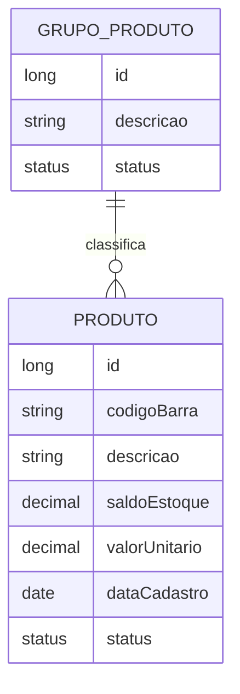

# Java – Spring Boot – Aula 02 – Criação do projeto

[⬅ Voltar para o índice do curso](../../README.md)

---

## Apresentação da aula

Nesta aula criaremos a aplicação Spring Boot que será desenvolvida durante o restante do curso.

Existirão dois tipos de projeto:

1. **Projeto de referência do professor:** `suporteos2026`.
2. **Projeto temático do estudante:** aplicação própria, inspirada na mesma estrutura do projeto de referência.

O `suporteos2026` será usado para:

- acompanhar as explicações;
- consultar a organização esperada;
- comparar implementações;
- recuperar o estado de cada aula pelas tags;
- entender como os conceitos são aplicados em um exemplo completo.

O estudante não deverá apenas trocar o nome “Produto” por outro nome no final do semestre. Nesta aula ele escolherá um tema, documentará suas decisões e continuará desenvolvendo esse mesmo tema nas próximas aulas.

> O projeto do professor é a referência técnica. O projeto do estudante é a aplicação individual dos conceitos.

## Resultado esperado

Ao final da aula, cada estudante deverá possuir:

- um tema aprovado;
- um nome estável para o projeto;
- um repositório temático próprio no GitHub;
- um projeto Maven gerado pelo Spring Initializr;
- Java 21 configurado;
- Spring Boot na versão definida para a turma;
- Spring Web e Validation;
- Maven Wrapper;
- um endpoint `/api/health` funcionando;
- o teste inicial aprovado;
- o primeiro commit do projeto publicado.

## Objetivos de aprendizagem

Ao concluir a aula, o estudante deverá ser capaz de:

1. Explicar a finalidade do Spring Initializr.
2. Criar um projeto pelo site `start.spring.io`.
3. Criar o mesmo projeto pelo IntelliJ IDEA Ultimate.
4. Reconhecer que os dois caminhos utilizam o Spring Initializr.
5. Escolher metadados coerentes para um projeto Maven.
6. Identificar a função do `pom.xml`.
7. Executar a aplicação pela IDE e pelo Maven Wrapper.
8. Criar um endpoint HTTP mínimo.
9. Planejar um domínio compatível com as próximas aulas.
10. Versionar o projeto sem incluir arquivos locais da IDE.

---

## 1. Projeto de referência e projeto do estudante

### 1.1 Projeto de referência

O projeto oficial da disciplina é:

```text
suporteos2026
```

Repositório:

<https://github.com/jeffersonarpasserini/suporteos2026>

Seu domínio de referência será um controle simplificado de estoque:



Nas próximas aulas, o professor implementará:

- `GrupoProduto`, como entidade de classificação;
- `Produto`, como entidade principal;
- relacionamento de vários produtos com um grupo;
- validações;
- consultas;
- operações CRUD;
- testes;
- banco PostgreSQL;
- migrations Liquibase;
- containers Docker.

### 1.2 Projeto temático do estudante

Cada estudante deverá criar um projeto próprio e manter o tema escolhido até o encerramento do curso.

Exemplo:

```text
Projeto de referência: GrupoProduto -> Produto
Projeto do estudante: CategoriaLivro -> Livro
```

Os nomes mudam, mas os conceitos estudados permanecem equivalentes.

### 1.3 Organização recomendada no computador

Mantenha os projetos em pastas diferentes:

```text
Projetos/
├── suporteos2026/       <- referência do professor
└── biblioteca2026/      <- projeto do estudante
```

Nunca crie o projeto temático dentro da pasta `suporteos2026`. Um repositório Git não deve ser colocado dentro de outro.

---

## 2. Contrato de compatibilidade do tema

O tema pode mudar, mas precisa permitir a prática dos mesmos conceitos.

### 2.1 Estrutura mínima obrigatória

O projeto terá inicialmente duas entidades.

#### Entidade de classificação

Representa uma categoria, tipo, grupo, setor ou modalidade.

Deve possuir conceitualmente:

| Campo | Finalidade |
|---|---|
| Identificador | Distinguir cada registro |
| Nome ou descrição | Apresentar a classificação |
| Status | Indicar registro ativo ou inativo |

No projeto de referência:

```text
GrupoProduto
```

#### Entidade principal

Representa o elemento administrado pela aplicação.

Deve permitir conceitualmente:

| Informação | Exemplo em Produto |
|---|---|
| Identificador | ID do produto |
| Código único | Código de barras |
| Nome ou descrição | Descrição do produto |
| Medida quantitativa | Saldo em estoque |
| Valor monetário | Valor unitário |
| Data | Data de cadastro |
| Status | Ativo ou inativo |
| Classificação | Grupo do produto |

O nome dos campos será adaptado ao domínio. Não é necessário usar “saldo” quando outra medida fizer mais sentido.

### 2.2 Relacionamento obrigatório

Cada registro principal pertence a uma classificação:

```text
Uma classificação pode possuir vários registros principais.
Cada registro principal pertence a uma classificação.
```

Exemplo:

```text
Uma CategoriaLivro classifica vários Livros.
Cada Livro pertence a uma CategoriaLivro.
```

Esse relacionamento permitirá estudar associação muitos-para-um, chave estrangeira e integridade referencial.

### 2.3 Por que precisamos de medida e valor?

As próximas aulas utilizarão:

- números inteiros e decimais;
- `BigDecimal`;
- precisão de banco;
- validações positivas;
- cálculos de domínio;
- JSON com valores numéricos.

Por isso o tema deve possuir:

- uma medida quantitativa;
- um valor monetário coerente.

Exemplos de medida:

- quantidade disponível;
- número de exemplares;
- capacidade de participantes;
- duração estimada em horas;
- quantidade de vagas;
- quilometragem permitida;
- peso disponível.

Exemplos de valor:

- preço unitário;
- valor de reposição;
- valor da diária;
- valor da inscrição;
- custo estimado;
- mensalidade;
- tarifa do serviço.

### 2.4 Tamanho adequado do tema

O tema deve ser pequeno o suficiente para acompanhar as aulas.

Nesta primeira etapa, não escolher sistemas que exijam obrigatoriamente:

- autenticação de vários tipos de usuários;
- pagamentos reais;
- mapas e geolocalização;
- prontuários ou dados pessoais sensíveis;
- redes sociais completas;
- dezenas de entidades;
- integrações externas obrigatórias;
- emissão fiscal;
- regras contábeis complexas.

Esses recursos podem ser interessantes, mas desviariam o foco de Spring, HTTP, persistência e testes.

---

## 3. Sugestões de temas compatíveis

| Tema | Classificação | Entidade principal | Código único | Medida | Valor |
|---|---|---|---|---|---|
| Biblioteca | CategoriaLivro | Livro | ISBN | Exemplares | Valor de reposição |
| Oficina | CategoriaServico | Servico | Código do serviço | Horas estimadas | Valor base |
| Locação | CategoriaEquipamento | Equipamento | Patrimônio | Quantidade disponível | Valor da diária |
| Eventos | CategoriaEvento | Evento | Código do evento | Capacidade | Valor da inscrição |
| Pet shop | CategoriaItem | ItemPet | SKU | Estoque | Preço unitário |
| Farmácia didática | CategoriaMedicamento | Medicamento | Código de registro | Estoque | Preço unitário |
| Papelaria | CategoriaMaterial | MaterialEscolar | Código do item | Estoque | Preço unitário |
| Jogos | GeneroJogo | Jogo | Código do jogo | Unidades disponíveis | Preço |
| Cursos livres | CategoriaCurso | Curso | Código do curso | Carga horária | Valor da matrícula |
| Atendimento | TipoAtendimento | Chamado | Protocolo | Horas previstas | Custo estimado |
| Academia | Modalidade | Plano | Código do plano | Duração em meses | Mensalidade |
| Estacionamento | TipoVaga | Vaga | Código da vaga | Horas permitidas | Tarifa |

Os exemplos são sugestões. Outro tema poderá ser usado se cumprir o contrato de compatibilidade e for aprovado pelo professor.

> Utilize apenas dados fictícios. Mesmo em temas como farmácia ou atendimento, não serão armazenados dados reais de pacientes, clientes ou outras pessoas.

---

## 4. Ficha de definição do projeto

Antes de gerar o Spring Boot, crie uma ficha em papel, no caderno ou em um arquivo temporário.

```markdown
# Tema do projeto

## Identificação

- Nome do projeto:
- Tema:
- Objetivo em uma frase:

## Entidade de classificação

- Nome no singular:
- Nome no plural:
- Exemplo 1:
- Exemplo 2:

## Entidade principal

- Nome no singular:
- Nome no plural:
- Código único:
- Descrição:
- Medida quantitativa:
- Valor monetário:
- Data relevante:
- Status:

## Relacionamento

- Uma classificação pode possuir vários:
- Cada registro principal pertence a:

## Três exemplos de registros

1.
2.
3.
```

### 4.1 Exemplo preenchido — biblioteca

```markdown
# Tema do projeto

## Identificação

- Nome do projeto: biblioteca2026
- Tema: controle de livros de uma biblioteca didática
- Objetivo em uma frase: cadastrar livros e organizá-los por categoria

## Entidade de classificação

- Nome no singular: CategoriaLivro
- Nome no plural: CategoriasLivro
- Exemplo 1: Literatura Brasileira
- Exemplo 2: Computação

## Entidade principal

- Nome no singular: Livro
- Nome no plural: Livros
- Código único: ISBN
- Descrição: título do livro
- Medida quantitativa: quantidade de exemplares
- Valor monetário: valor de reposição
- Data relevante: data de cadastro
- Status: ativo ou inativo

## Relacionamento

- Uma categoria pode possuir vários livros.
- Cada livro pertence a uma categoria.
```

### 4.2 Critérios de aprovação

O professor verificará:

- existência das duas entidades;
- relacionamento coerente;
- código único;
- medida quantitativa;
- valor monetário;
- data relevante;
- status;
- escopo compatível com o semestre;
- nomes compreensíveis em português;
- ausência de dados sensíveis obrigatórios.

Após a aprovação, o tema não deve ser trocado sem conversar com o professor. Trocas tardias geram retrabalho nas entidades, banco, testes e documentação.

---

## 5. Definindo os nomes técnicos

Utilizaremos o exemplo de biblioteca nas orientações do estudante.

### 5.1 Nome do repositório e artifact

Use letras minúsculas, sem espaços e sem acentos:

```text
biblioteca2026
```

Outros exemplos:

```text
oficina2026
eventos2026
locacao2026
```

### 5.2 Package

Use letras minúsculas e pontos:

```text
com.curso.biblioteca
```

Não usar:

```text
com.curso.Biblioteca
com.curso.biblioteca-2026
com.curso.biblioteca 2026
```

### 5.3 Classe principal

O nome será derivado do projeto:

```text
BibliotecaApplication
```

### 5.4 Quadro de correspondência

| Metadado | Referência | Exemplo do estudante |
|---|---|---|
| Name | `suporteos2026` | `biblioteca2026` |
| Artifact | `suporteos2026` | `biblioteca2026` |
| Package | `com.curso.suporteos` | `com.curso.biblioteca` |
| Classe principal | `SuporteosApplication` | `BibliotecaApplication` |

O `Group` permanecerá igual para facilitar as aulas:

```text
com.curso
```

---

## 6. Criando o repositório temático no GitHub

Cada estudante terá seu próprio repositório para continuar nas próximas aulas.

1. Acesse <https://github.com/new>.
2. Escolha sua conta como **Owner**.
3. Use como nome o nome técnico aprovado, por exemplo `biblioteca2026`.
4. Escreva uma descrição curta.
5. Defina a visibilidade conforme orientação do professor.
6. Deixe README, `.gitignore` e licença desmarcados.
7. Clique em **Create repository**.
8. Mantenha aberta a página **Quick setup** para copiar a URL depois.

Não clone o repositório vazio neste momento. Primeiro geraremos a aplicação localmente e depois ligaremos essa pasta ao remoto.

---

## 7. Parâmetros padronizados do Spring Initializr

O projeto de referência será configurado assim:

```text
Project: Maven
Language: Java
Spring Boot: 4.0.7
Group: com.curso
Artifact: suporteos2026
Name: suporteos2026
Description: API didática do curso de Spring Boot 2026
Package name: com.curso.suporteos
Packaging: Jar
Java: 21
```

O estudante adapta somente os dados do tema:

```text
Project: Maven
Language: Java
Spring Boot: 4.0.7
Group: com.curso
Artifact: biblioteca2026
Name: biblioteca2026
Description: API didática para controle de livros
Package name: com.curso.biblioteca
Packaging: Jar
Java: 21
```

> Use exatamente a versão congelada pelo professor. Não selecionar versões `SNAPSHOT`, `M1`, `M2`, `RC1` ou outra versão de pré-lançamento.

### 7.1 Dependências iniciais

Adicionar somente:

- **Spring Web**;
- **Validation**;
- **Spring Boot DevTools**, se confirmado pelo professor.

Nesta aula não adicionar:

- Spring Data JPA;
- PostgreSQL Driver;
- H2 Database;
- Liquibase;
- Spring Security;
- Lombok.

Cada dependência será introduzida quando surgir o problema que ela resolve.

---

## 8. Caminho A — criação pelo site Spring Initializr

Este caminho funciona independentemente da IDE.

### 8.1 Abrindo o Initializr

Acesse:

<https://start.spring.io/>

O Spring Initializr gera a estrutura inicial e o arquivo de build com base nas escolhas realizadas.

### 8.2 Configurando o projeto

1. Selecione **Maven** em Project.
2. Selecione **Java** em Language.
3. Selecione **4.0.7** em Spring Boot.
4. Abra **Project Metadata**.
5. Preencha `Group`, `Artifact`, `Name`, `Description` e `Package name` com os dados do seu tema.
6. Selecione **Jar** em Packaging.
7. Selecione **21** em Java.

Revise especialmente:

- ausência de acentos no artifact;
- package em letras minúsculas;
- versão Java 21;
- versão Spring Boot definida para a turma.

### 8.3 Adicionando dependências

Clique em **Add Dependencies**.

Pesquise e adicione:

```text
Spring Web
Validation
Spring Boot DevTools
```

DevTools poderá ser omitido se o professor optar por não utilizá-lo.

### 8.4 Gerando o ZIP

Clique em **Generate**.

Será baixado um arquivo semelhante a:

```text
biblioteca2026.zip
```

### 8.5 Extraindo corretamente

Extraia o ZIP dentro da pasta de projetos:

```text
Projetos/
├── suporteos2026/
└── biblioteca2026/
```

Evite esta estrutura incorreta:

```text
Projetos/
└── biblioteca2026/
    └── biblioteca2026/
        └── pom.xml
```

A raiz correta é a pasta que contém diretamente o `pom.xml`.

### 8.6 Abrindo no IntelliJ Ultimate

1. Abra o IntelliJ IDEA Ultimate.
2. Escolha **File → Open**.
3. Selecione a pasta que contém `pom.xml`.
4. Confirme **Trust Project** se a IDE solicitar.
5. Aguarde a sincronização do Maven.
6. Não feche a IDE enquanto dependências estiverem sendo baixadas.
7. Confira o JDK em **File → Project Structure → Project**.

O Project SDK deve ser Java 21.

---

## 9. Caminho B — criação pelo IntelliJ IDEA Ultimate

O IntelliJ IDEA Ultimate possui um assistente integrado ao Spring Initializr. O resultado deve ser equivalente ao caminho do site.

### 9.1 Abrindo o assistente

Na tela inicial:

```text
New Project
```

Se outro projeto já estiver aberto:

```text
File → New → Project
```

Na lista de geradores, selecione:

```text
Spring Boot
```

Em versões anteriores da IDE, o nome pode aparecer como `Spring Initializr`.

### 9.2 Primeira etapa

Preencha:

```text
Server URL: https://start.spring.io
Name: biblioteca2026
Location: pasta de projetos escolhida
Language: Java
Type: Maven
Group: com.curso
Artifact: biblioteca2026
Package name: com.curso.biblioteca
JDK: 21
Java: 21
Packaging: Jar
```

Se Java 21 estiver instalado, mas não aparecer:

1. Abra a lista JDK.
2. Escolha **Add JDK from Disk**.
3. Selecione a pasta raiz do JDK 21.

Não selecione **Create Git repository** se o professor quiser demonstrar a inicialização pelo terminal igualmente nos dois caminhos. Faremos isso em uma etapa comum.

Clique em **Next**.

### 9.3 Segunda etapa

1. Selecione Spring Boot `4.0.7`.
2. Localize Spring Web.
3. Localize Validation.
4. Adicione DevTools somente conforme o padrão da turma.
5. Confira se nenhuma dependência adicional foi selecionada.
6. Clique em **Create**.

O IntelliJ irá:

- solicitar o projeto ao Spring Initializr;
- gerar os arquivos;
- abrir a pasta;
- importar o Maven;
- indexar o código.

### 9.4 Aguardar a sincronização

Na primeira abertura, o Maven precisa baixar dependências. O tempo depende da conexão e do cache local.

Confira a janela Maven. Não altere versões no `pom.xml` para tentar resolver um download ainda em andamento.

---

## 10. Escolha apenas um caminho

O professor demonstrará os dois métodos, mas o estudante criará seu projeto uma única vez.

Não faça:

1. gerar pelo site;
2. gerar novamente pelo IntelliJ;
3. copiar uma versão sobre a outra.

Essa sobreposição pode produzir:

- classes principais duplicadas;
- packages diferentes;
- versões diferentes no `pom.xml`;
- dois diretórios `.mvn`;
- configurações inconsistentes.

Se quiser praticar os dois caminhos, utilize pastas temporárias diferentes e apague a experiência somente depois de confirmar qual pasta será o projeto oficial. O repositório temático deve receber apenas uma delas.

---

## 11. Estrutura gerada

Independentemente do caminho, teremos aproximadamente:

```text
biblioteca2026/
├── .mvn/
│   └── wrapper/
│       └── maven-wrapper.properties
├── src/
│   ├── main/
│   │   ├── java/
│   │   │   └── com/
│   │   │       └── curso/
│   │   │           └── biblioteca/
│   │   │               └── Biblioteca2026Application.java
│   │   └── resources/
│   │       └── application.properties
│   └── test/
│       └── java/
│           └── com/
│               └── curso/
│                   └── biblioteca/
│                       └── Biblioteca2026ApplicationTests.java
├── .gitignore
├── mvnw
├── mvnw.cmd
└── pom.xml
```

O nome exato da classe principal depende dos metadados informados.

### 11.1 Arquivos importantes

| Caminho | Finalidade |
|---|---|
| `pom.xml` | Configuração Maven e dependências |
| `mvnw` | Maven Wrapper para macOS e Linux |
| `mvnw.cmd` | Maven Wrapper para Windows |
| `.mvn/wrapper` | Configuração da versão Maven do projeto |
| `src/main/java` | Código da aplicação |
| `src/main/resources` | Configurações e recursos |
| `src/test/java` | Testes automatizados |
| `application.properties` | Configuração Spring Boot |

### 11.2 O que não deve ser versionado

- `.idea`;
- `target`;
- arquivos `.class`;
- logs;
- `.env`;
- senhas ou tokens.

---

## 12. Entendendo o pom.xml

O `pom.xml` é o Project Object Model do Maven.

Estrutura aproximada:

```xml
<?xml version="1.0" encoding="UTF-8"?>
<project xmlns="http://maven.apache.org/POM/4.0.0"
         xmlns:xsi="http://www.w3.org/2001/XMLSchema-instance"
         xsi:schemaLocation="http://maven.apache.org/POM/4.0.0
         https://maven.apache.org/xsd/maven-4.0.0.xsd">

    <modelVersion>4.0.0</modelVersion>

    <parent>
        <groupId>org.springframework.boot</groupId>
        <artifactId>spring-boot-starter-parent</artifactId>
        <version>4.0.7</version>
        <relativePath/>
    </parent>

    <groupId>com.curso</groupId>
    <artifactId>biblioteca2026</artifactId>
    <version>0.0.1-SNAPSHOT</version>
    <name>biblioteca2026</name>

    <properties>
        <java.version>21</java.version>
    </properties>

    <dependencies>
        <dependency>
            <groupId>org.springframework.boot</groupId>
            <artifactId>spring-boot-starter-validation</artifactId>
        </dependency>

        <dependency>
            <groupId>org.springframework.boot</groupId>
            <artifactId>spring-boot-starter-webmvc</artifactId>
        </dependency>

        <dependency>
            <groupId>org.springframework.boot</groupId>
            <artifactId>spring-boot-devtools</artifactId>
            <scope>runtime</scope>
            <optional>true</optional>
        </dependency>

        <dependency>
            <groupId>org.springframework.boot</groupId>
            <artifactId>spring-boot-starter-validation-test</artifactId>
            <scope>test</scope>
        </dependency>

        <dependency>
            <groupId>org.springframework.boot</groupId>
            <artifactId>spring-boot-starter-webmvc-test</artifactId>
            <scope>test</scope>
        </dependency>
    </dependencies>

    <build>
        <plugins>
            <plugin>
                <groupId>org.springframework.boot</groupId>
                <artifactId>spring-boot-maven-plugin</artifactId>
            </plugin>
        </plugins>
    </build>
</project>
```

O arquivo efetivamente gerado é a fonte correta. O Spring Initializr 4.0.7 utiliza starters modulares, como `spring-boot-starter-webmvc`, e pode acrescentar starters de teste correspondentes às funcionalidades selecionadas. Pequenas diferenças de ordenação ou dependências auxiliares podem existir conforme as opções escolhidas.

### 12.1 Parent

```xml
<parent>
    <groupId>org.springframework.boot</groupId>
    <artifactId>spring-boot-starter-parent</artifactId>
    <version>4.0.7</version>
</parent>
```

O parent fornece padrões e gerenciamento de versões compatíveis.

### 12.2 Coordenadas Maven

```xml
<groupId>com.curso</groupId>
<artifactId>biblioteca2026</artifactId>
<version>0.0.1-SNAPSHOT</version>
```

Podemos imaginar as coordenadas como o endereço do artefato dentro do ecossistema Maven.

### 12.3 Starters

Um starter reúne dependências normalmente usadas em conjunto.

```xml
<artifactId>spring-boot-starter-webmvc</artifactId>
```

Ele prepara a base para aplicações HTTP com Spring MVC e servidor embutido.

Não é necessário baixar arquivos JAR manualmente nem copiá-los para uma pasta `lib`.

### 12.4 Scope de teste

```xml
<scope>test</scope>
```

Indica que a dependência é usada no ciclo de testes e não precisa fazer parte da aplicação em execução.

### 12.5 Plugin Spring Boot

O plugin permite tarefas como:

- executar a aplicação;
- empacotar o projeto;
- criar um JAR executável.

---

## 13. Maven Wrapper

O curso utilizará o Maven Wrapper.

No Windows PowerShell:

```powershell
.\mvnw.cmd --version
```

No Prompt de Comando:

```bat
mvnw.cmd --version
```

No macOS ou Linux:

```bash
./mvnw --version
```

O Wrapper:

- registra a versão Maven esperada;
- reduz diferenças entre computadores;
- dispensa depender exclusivamente de uma instalação global;
- deve ser versionado com o projeto.

Na primeira execução, ele poderá baixar a distribuição Maven. Isso é esperado.

---

## 14. Classe principal

O Initializr gera uma classe semelhante a:

```java
package com.curso.biblioteca;

import org.springframework.boot.SpringApplication;
import org.springframework.boot.autoconfigure.SpringBootApplication;

@SpringBootApplication
public class Biblioteca2026Application {

    public static void main(String[] args) {
        SpringApplication.run(Biblioteca2026Application.class, args);
    }
}
```

### 14.1 @SpringBootApplication

Essa anotação marca a classe de inicialização e reúne configurações importantes do Spring Boot.

### 14.2 Pacote raiz

A classe principal deve ficar no pacote raiz:

```text
com.curso.biblioteca
```

As próximas camadas serão criadas abaixo dele:

```text
com.curso.biblioteca
├── api
├── domain
├── repository
└── service
```

Essa posição permite que o Spring encontre componentes nos subpacotes sem configurações manuais de scan.

Não mover a classe principal para um pacote lateral ou para fora da árvore do projeto.

---

## 15. Executando o teste inicial

Antes de acrescentar código:

No Windows:

```powershell
.\mvnw.cmd test
```

No macOS ou Linux:

```bash
./mvnw test
```

Ao final, procure:

```text
BUILD SUCCESS
```

Se o teste falhar, não continue adicionando funcionalidades. Primeiro identifique o motivo.

---

## 16. Primeira execução

### 16.1 Pelo IntelliJ IDEA Ultimate

1. Abra a classe principal.
2. Localize o triângulo verde ao lado da classe ou do método `main`.
3. Clique nele.
4. Escolha **Run**.
5. Acompanhe a janela de execução.

Uma inicialização correta apresenta mensagem semelhante a:

```text
Started Biblioteca2026Application
```

### 16.2 Pelo Maven Wrapper

Windows:

```powershell
.\mvnw.cmd spring-boot:run
```

macOS ou Linux:

```bash
./mvnw spring-boot:run
```

Para encerrar no terminal:

```text
Ctrl + C
```

### 16.3 Porta padrão

Por padrão, a aplicação web utiliza:

```text
http://localhost:8080
```

Ainda não criamos uma página ou endpoint. Dependendo da configuração, abrir a raiz poderá retornar uma resposta de recurso não encontrado. Isso não significa que a aplicação falhou.

---

## 17. Criando o primeiro endpoint

Crie o pacote:

```text
com.curso.biblioteca.api
```

Dentro dele, crie `HealthController`:

```java
package com.curso.biblioteca.api;

import org.springframework.web.bind.annotation.GetMapping;
import org.springframework.web.bind.annotation.RestController;

@RestController
public class HealthController {

    @GetMapping("/api/health")
    public String health() {
        return "OK";
    }
}
```

No projeto do professor, o package será:

```java
package com.curso.suporteos.api;
```

### 17.1 @RestController

Indica que a classe recebe requisições HTTP e devolve dados diretamente na resposta.

### 17.2 @GetMapping

Associa o método a uma requisição HTTP GET:

```text
GET /api/health
```

### 17.3 Testando no navegador

Abra:

<http://localhost:8080/api/health>

Resposta esperada:

```text
OK
```

### 17.4 Testando pelo terminal

Com `curl`:

```bash
curl http://localhost:8080/api/health
```

No PowerShell:

```powershell
Invoke-WebRequest http://localhost:8080/api/health
```

O status HTTP esperado é `200`.

---

## 18. Configuração inicial da aplicação

Abra:

```text
src/main/resources/application.properties
```

Defina o nome da aplicação usando o nome do tema:

```properties
spring.application.name=biblioteca2026
```

No projeto de referência:

```properties
spring.application.name=suporteos2026
```

Nesta aula não adicionaremos configurações de banco, usuário, senha ou perfil.

---

## 19. Documentando o tema dentro do projeto

Crie:

```text
docs/tema-do-projeto.md
```

Use a ficha aprovada da seção 4.

Esse arquivo será consultado nas aulas de:

- domínio;
- JPA;
- DTOs;
- endpoints;
- testes;
- Liquibase;
- documentação final.

O tema deve aparecer também no README:

```markdown
## Tema

API didática para controle de livros de uma biblioteca, organizados por categoria.
```

---

## 20. Ligando o projeto ao GitHub

Abra o terminal na pasta que contém `pom.xml`.

### 20.1 Verificando se já existe Git

```bash
git status
```

Se o IntelliJ criou o Git por engano, o comando funcionará. Confira o remoto:

```bash
git remote -v
```

Se nenhum repositório Git existir, inicialize:

```bash
git init -b main
```

### 20.2 Adicionando o remoto pessoal

Com SSH:

```bash
git remote add origin git@github.com:SEU-USUARIO/biblioteca2026.git
```

Com HTTPS:

```bash
git remote add origin https://github.com/SEU-USUARIO/biblioteca2026.git
```

Substitua `SEU-USUARIO` e `biblioteca2026` pelos seus valores.

Confira:

```bash
git remote -v
```

O projeto do estudante não deve apontar para o remoto do professor.

---

## 21. Revisando antes do primeiro commit

Execute:

```bash
git status
```

Devem aparecer arquivos como:

- `.mvn/wrapper/maven-wrapper.properties`;
- `mvnw`;
- `mvnw.cmd`;
- `pom.xml`;
- `src/main`;
- `src/test`;
- `docs/tema-do-projeto.md`;
- `README.md`.

Não devem aparecer:

- `.idea`;
- `target`;
- `.env`;
- arquivos com senha;
- projeto de referência copiado;
- outro diretório `.git`.

### 21.1 Atenção ao .gitignore gerado

O Initializr poderá gerar um `.gitignore`. Compare-o com o padrão estudado na Aula 00 e garanta que pelo menos contenha:

```gitignore
.idea/
target/
.env
.env.*
!.env.example
.DS_Store
**/.DS_Store
```

Não apague regras úteis geradas automaticamente sem entender sua finalidade.

---

## 22. Commit e publicação

Prepare os arquivos depois da revisão:

```bash
git add .gitignore .mvn mvnw mvnw.cmd pom.xml README.md docs src
git status
```

Crie o commit:

```bash
git commit -m "Aula 02: cria o projeto Spring Boot"
```

Publique:

```bash
git push -u origin main
```

Abra o GitHub e confira:

- `pom.xml` visível;
- Maven Wrapper presente;
- código em `src`;
- tema documentado;
- ausência de `.idea` e `target`;
- commit na branch `main`.

---

## 23. Comparando os dois caminhos

| Aspecto | Site Initializr | IntelliJ Ultimate |
|---|---|---|
| Geração | Download de ZIP | Direto pela IDE |
| Serviço utilizado | `start.spring.io` | API do `start.spring.io` |
| Maven | Configurado no ZIP | Configurado pelo assistente |
| Dependências | Selecionadas no navegador | Selecionadas na IDE |
| Importação | Manual pelo `pom.xml` | Automática |
| Resultado esperado | Projeto equivalente | Projeto equivalente |

Um método não produz um Spring Boot “melhor” que o outro. O que determina o projeto são os metadados, a versão e as dependências selecionadas.

---

## 24. Problemas frequentes

### 24.1 Java 21 não aparece no IntelliJ

Abra:

```text
File → Project Structure → Project
```

Adicione o diretório do JDK 21. Não selecione apenas uma JRE.

Confira no terminal da IDE:

```bash
java -version
```

### 24.2 Maven não termina de sincronizar

Verifique:

- conexão com a internet;
- mensagens na janela Maven;
- modo offline desativado;
- Java 21 selecionado;
- `pom.xml` sem alterações manuais inválidas.

Não adicione versões aleatórias às dependências gerenciadas pelo Spring Boot.

### 24.3 pom.xml não aparece na raiz

Provavelmente a pasta errada foi aberta.

Localize a pasta que contém diretamente:

```text
pom.xml
mvnw
mvnw.cmd
src
```

Abra essa pasta no IntelliJ.

### 24.4 Porta 8080 ocupada

Pode haver outra aplicação em execução. Encerre a execução anterior na IDE ou no terminal.

Nesta aula não altere a porta apenas para esconder o problema. Primeiro identifique o processo que continua executando.

### 24.5 Endpoint retorna 404

Confira:

- aplicação em execução;
- URL `/api/health`;
- classe dentro de subpacote da classe principal;
- anotação `@RestController`;
- anotação `@GetMapping`;
- imports do pacote `org.springframework.web.bind.annotation`.

### 24.6 package declarado não corresponde à pasta

Use o refactor do IntelliJ para mover ou renomear packages. Evite mover arquivos Java manualmente pelo gerenciador de arquivos.

### 24.7 remote origin já existe

Confira antes de alterar:

```bash
git remote -v
```

Se estiver correto, não adicione novamente. Se apontar para um endereço incorreto, solicite orientação antes de alterar.

### 24.8 Push foi para o projeto do professor

O remoto do estudante deve apontar para seu repositório temático:

```bash
git remote -v
```

Não tente forçar um push ao repositório de referência.

### 24.9 BUILD FAILURE

Leia o primeiro erro relevante, não apenas a última linha. Verifique:

```bash
java -version
./mvnw --version
```

No Windows:

```powershell
.\mvnw.cmd --version
```

---

## 25. Atividade orientada

### Parte A — definição do domínio

1. Escolha um tema.
2. Preencha a ficha.
3. Defina a classificação.
4. Defina a entidade principal.
5. Escolha código, medida, valor, data e status.
6. Apresente ao professor.

### Parte B — criação

1. Escolha um dos dois caminhos.
2. Gere o projeto.
3. Confira Java, Boot, package e dependências.
4. Execute o teste inicial.
5. Execute a aplicação.

### Parte C — primeira funcionalidade

1. Crie `HealthController`.
2. Execute `GET /api/health`.
3. Confirme resposta `OK` e status 200.
4. Defina `spring.application.name`.

### Parte D — documentação e Git

1. Crie `docs/tema-do-projeto.md`.
2. Atualize o README.
3. Revise `git status`.
4. Crie o commit.
5. Publique no repositório temático.

---

## 26. Perguntas de revisão

1. Qual é a finalidade do Spring Initializr?
2. Qual é a diferença entre o projeto de referência e o projeto temático?
3. Por que o tema precisa de duas entidades relacionadas?
4. Por que precisamos de uma medida e um valor monetário?
5. O que representa o `groupId`?
6. O que representa o `artifactId`?
7. Para que serve o `pom.xml`?
8. O que é um starter?
9. Por que usar o Maven Wrapper?
10. Qual é a função de `@SpringBootApplication`?
11. Por que a classe principal fica no pacote raiz?
12. O que `@RestController` indica?
13. O que significa receber HTTP 200?
14. Por que não devemos selecionar todas as dependências no Initializr?
15. Por que `.idea` e `target` não devem ser versionados?

---

## 27. Checklist do estudante

### Tema

- [ ] O tema foi escolhido e aprovado.
- [ ] Existe entidade de classificação.
- [ ] Existe entidade principal.
- [ ] O relacionamento é coerente.
- [ ] Existe código único.
- [ ] Existe medida quantitativa.
- [ ] Existe valor monetário.
- [ ] Existe data relevante.
- [ ] Existe status.
- [ ] O tema será mantido nas próximas aulas.

### Projeto

- [ ] O projeto foi criado por apenas um caminho.
- [ ] Maven foi selecionado.
- [ ] Java foi selecionado como linguagem.
- [ ] Java 21 foi selecionado.
- [ ] Spring Boot 4.0.7 foi selecionado.
- [ ] Packaging está como Jar.
- [ ] Package está em letras minúsculas.
- [ ] Spring Web está presente.
- [ ] Validation está presente.
- [ ] Dependências futuras não foram antecipadas.
- [ ] Maven Wrapper está presente.

### Execução

- [ ] O teste inicial passa.
- [ ] A aplicação inicia.
- [ ] `/api/health` retorna `OK`.
- [ ] O status da resposta é 200.
- [ ] A aplicação pode ser encerrada corretamente.

### GitHub

- [ ] O projeto temático possui repositório próprio.
- [ ] `origin` aponta para o repositório do estudante.
- [ ] `.idea` não está versionado.
- [ ] `target` não está versionado.
- [ ] Não existem credenciais.
- [ ] O tema está documentado.
- [ ] O commit foi publicado.

---

## 28. Ponto de quebra da Aula 02

Antes de criar a tag:

Windows:

```powershell
.\mvnw.cmd test
git status
```

macOS ou Linux:

```bash
./mvnw test
git status
```

O projeto deve:

1. compilar;
2. passar no teste;
3. iniciar sem banco de dados;
4. responder `/api/health`;
5. não possuir alterações pendentes;
6. não conter senhas;
7. estar publicado no GitHub.

Commit sugerido:

```bash
git commit -m "Aula 02: cria o projeto Spring Boot"
```

Tag sugerida:

```bash
git tag -a aula-02-projeto-spring-boot -m "Conclusão da Aula 02"
git push origin aula-02-projeto-spring-boot
```

---

## 29. Orientações para o professor

### 29.1 Sequência sugerida

| Etapa | Tempo aproximado |
|---|---:|
| Referência e contrato de tema | 25 minutos |
| Escolha e validação dos temas | 30 minutos |
| Demonstração pelo site | 25 minutos |
| Demonstração pelo IntelliJ Ultimate | 25 minutos |
| Estrutura, `pom.xml` e Wrapper | 25 minutos |
| Execução e health endpoint | 30 minutos |
| GitHub, revisão e fechamento | 20 minutos |

Adapte à duração da aula. Se necessário, a ficha de tema pode ser entregue como atividade preparatória.

### 29.2 Controle dos temas

Mantenha uma relação contendo:

- estudante;
- nome do repositório;
- tema;
- entidade de classificação;
- entidade principal;
- medida;
- valor;
- status de aprovação.

Evite aprovar temas iguais para toda a turma quando a avaliação exigir autoria individual. Temas próximos podem ser aceitos se os nomes e regras de domínio forem diferentes.

### 29.3 Critério de acompanhamento

Nas aulas seguintes, apresente primeiro o código do `suporteos2026` e depois reserve tempo para que cada estudante traduza o conceito para seu tema.

Exemplo:

```text
Professor implementa GrupoProduto.
Estudante implementa CategoriaLivro, TipoAtendimento ou Modalidade.
```

Não fornecer apenas um bloco de código para substituição automática de palavras. Solicite que o estudante explique a correspondência entre o exemplo e seu domínio.

---

## Referências oficiais

- [Spring Initializr](https://start.spring.io/)
- [Criando uma aplicação com Spring Boot — Spring](https://spring.io/guides/gs/spring-boot)
- [Spring Boot project wizard — IntelliJ IDEA](https://www.jetbrains.com/help/idea/spring-initializr-project-wizard.html)
- [Suporte Spring no IntelliJ IDEA](https://www.jetbrains.com/help/idea/spring-boot.html)
- [Apache Maven](https://maven.apache.org/)

---

[⬅ Voltar para o índice do curso](../../README.md)
