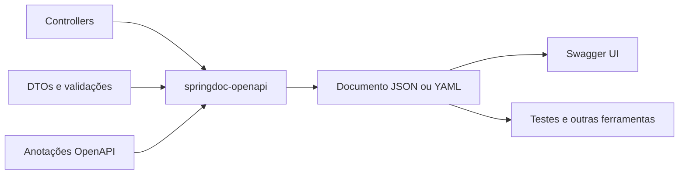

# Aula 09 — OpenAPI: contrato executável e documentação da API

[⬅ Voltar para o índice do curso](../../README.md)

---

## Apresentação

Nas Aulas 07 e 08 construímos uma API REST com DTOs, validação, tratamento de erros, operações de cadastro, alteração, exclusão, movimentação de estoque, filtros e paginação. A aplicação funciona e possui testes, mas um consumidor externo ainda precisa consultar o código-fonte ou receber explicações do desenvolvedor para descobrir como usá-la.

Essa situação torna-se mais problemática quando equipes diferentes trabalham no mesmo sistema. Uma equipe pode implementar o backend, outra pode desenvolver uma interface web e uma terceira pode integrar um aplicativo móvel. Todas precisam concordar sobre caminhos, métodos, parâmetros, formatos JSON e respostas de erro.

Nesta aula transformaremos o contrato HTTP existente em uma descrição OpenAPI legível por pessoas e ferramentas. O objetivo não é produzir uma página bonita. O objetivo é tornar decisões da API explícitas, verificáveis e reutilizáveis.

Uma ideia acompanhará toda a aula:

> A geração automática cria um primeiro retrato da API; o desenvolvedor continua responsável por revisar seu significado.

Essa ideia recupera a Aula 06: assim como o diff do Liquibase não substitui a revisão de uma migração, a documentação gerada não substitui a revisão do contrato.

### Problema orientador

> Como permitir que uma equipe consumidora descubra, compreenda e experimente a API sem ler os controllers nem depender de explicações orais?

### Escopo da aula

Nesta aula iremos:

- gerar um documento OpenAPI a partir da aplicação;
- disponibilizar as representações JSON e YAML;
- explorar a documentação com Swagger UI;
- organizar operações por recurso;
- documentar parâmetros, DTOs, paginação e erros;
- testar automaticamente a existência do contrato;
- analisar limites e riscos da documentação automática.

Não iremos implementar autenticação, autorização, geração de clientes ou um portal público. Esses recursos podem consumir OpenAPI futuramente, mas não são necessários para compreender o contrato.

---

## Resultados de aprendizagem

Ao final da aula, o estudante deverá ser capaz de:

1. explicar a diferença entre OpenAPI, documento OpenAPI, Swagger UI e `springdoc-openapi`;
2. identificar `paths`, operações, parâmetros, respostas e schemas em um documento OpenAPI;
3. gerar documentação OpenAPI a partir de uma aplicação Spring MVC;
4. configurar metadados globais da API;
5. documentar a intenção de endpoints e as respostas de sucesso e erro;
6. enriquecer DTOs com descrições, exemplos e restrições;
7. verificar se filtros e paginação estão compreensíveis para um consumidor;
8. escrever um teste automatizado para rotas essenciais do contrato;
9. diagnosticar divergências entre implementação e documentação;
10. aplicar o mesmo processo à API do tema individual.

---

## Pré-requisitos

Antes de começar, confirme:

- Java 21 instalado;
- Docker Desktop iniciado;
- PostgreSQL do curso disponível;
- arquivo `.env` local configurado e ignorado pelo Git;
- projeto no ponto de quebra da Aula 08;
- conhecimentos de controller, DTO, Bean Validation, MockMvc e semântica HTTP;
- cadastros de grupos e produtos funcionando.

No macOS ou Linux:

```bash
git status
./mvnw test
```

No Windows:

```powershell
git status
.\mvnw.cmd test
```

Resultado esperado antes da alteração:

```text
Tests run: 48, Failures: 0, Errors: 0, Skipped: 0
BUILD SUCCESS
```

Se os testes anteriores não passam, registre a causa antes de adicionar uma dependência. Misturar um defeito antigo com o incremento da aula dificulta o diagnóstico.

---

## 1. O problema de um contrato implícito

Considere a operação:

```http
GET /api/produtos/{id}
```

O caminho não responde sozinho:

- qual tipo de valor substitui `{id}`;
- quais campos aparecem na resposta;
- qual formato representa valores monetários;
- se fornecedor é obrigatório;
- o que acontece quando o produto não existe;
- se a resposta alimenta uma tela de alteração;
- quais códigos HTTP podem ocorrer.

Essas informações já estão distribuídas entre controller, DTO, service, validações, advice e testes. O contrato está implementado, mas permanece implícito para quem não conhece o projeto.

OpenAPI cria uma representação explícita dessa superfície HTTP.

---

## 2. OpenAPI, Swagger UI e springdoc

Os três nomes aparecem juntos, mas não representam a mesma coisa.

| Elemento | Responsabilidade |
|---|---|
| OpenAPI Specification | define a linguagem padronizada para descrever APIs HTTP |
| Documento OpenAPI | JSON ou YAML que descreve uma API concreta |
| Swagger UI | interface web que lê o documento e apresenta operações interativas |
| `springdoc-openapi` | biblioteca que examina a aplicação Spring e produz o documento |

O fluxo desta aula é:



### OpenAPI não é a implementação

O documento informa que uma operação existe, mas não executa a regra de negócio. Se o documento declarar `404` e o controller devolver `500`, a documentação não corrige o comportamento.

### Swagger UI não é um teste automatizado

O botão **Execute** ajuda a explorar a API, demonstrar cenários e investigar respostas. Entretanto, ele depende de ação humana e não protege o projeto contra regressões. Os testes MockMvc continuam necessários.

### Documentação automática não é documentação infalível

A biblioteca reconhece assinaturas e tipos, mas não conhece completamente a intenção do negócio. Ela não deduz, por exemplo, por que o saldo não aparece no `PUT` de produto ou por que um grupo em uso produz `409`.

---

## 3. Duas estratégias de autoria

### Design-first

O contrato OpenAPI é escrito antes da implementação. Equipes podem discutir e validar a interface antes do código existir.

Vantagens:

- favorece negociação antecipada;
- permite criar mocks e clientes antes do backend;
- reduz decisões acidentais na implementação.

Risco:

- implementação e documento podem divergir se não houver verificação contínua.

### Code-first

O documento é derivado do código e enriquecido com anotações.

Vantagens:

- aproveita controllers, DTOs e validações existentes;
- oferece retorno rápido em projetos já implementados;
- reduz repetição estrutural.

Risco:

- pode transformar detalhes acidentais do código em contrato público;
- pode produzir documentação tecnicamente válida, mas pouco explicativa.

### Decisão do curso

Usaremos **code-first** porque a API já existe. Isso não significa declarar o código perfeito. O documento gerado será analisado como evidência e revisado conscientemente.

---

## 4. Mapeamento teoria–prática

| Ação | Conceito observado |
|---|---|
| adicionar o starter | integração entre metadados da aplicação e representação do contrato |
| abrir `/v3/api-docs` | documento OpenAPI processável por ferramentas |
| abrir Swagger UI | projeção visual e cliente exploratório |
| configurar `Info` | identidade e versão do contrato |
| usar `@Tag` | organização por recursos |
| usar `@Operation` | intenção de cada caso de uso HTTP |
| usar `@ApiResponse` | resultados possíveis e semântica de status |
| usar `@Schema` | forma e significado das representações |
| testar `/v3/api-docs` | contrato como artefato sujeito a regressão |

---

## 5. Checkpoint 1 — Adicionar a integração

### Intenção

Adicionar a biblioteca que examina a aplicação Spring MVC e publica o documento e a interface visual.

### Arquivo

`pom.xml`

Adicione junto às dependências web:

```xml
<dependency>
    <groupId>org.springdoc</groupId>
    <artifactId>springdoc-openapi-starter-webmvc-ui</artifactId>
    <version>3.1.1</version>
</dependency>
```

O sufixo `webmvc-ui` registra:

- suporte à pilha Spring MVC utilizada pelo projeto;
- endpoint do documento OpenAPI;
- recursos da interface Swagger UI.

Não use starters destinados a WebFlux, pois o projeto não é reativo.

### Verificação

No macOS ou Linux:

```bash
./mvnw test
```

No Windows:

```powershell
.\mvnw.cmd test
```

A primeira execução pode baixar novas dependências. Falha de resolução de artefato deve ser distinguida de falha de compilação.

---

## 6. Checkpoint 2 — Observar o contrato gerado

Inicie a aplicação com o profile de desenvolvimento.

No macOS ou Linux:

```bash
./mvnw spring-boot:run -Dspring-boot.run.profiles=dev
```

No Windows:

```powershell
.\mvnw.cmd spring-boot:run "-Dspring-boot.run.profiles=dev"
```

Acesse:

| Recurso | Endereço |
|---|---|
| documento JSON | <http://localhost:8080/v3/api-docs> |
| documento YAML | <http://localhost:8080/v3/api-docs.yaml> |
| interface Swagger UI | <http://localhost:8080/swagger-ui.html> |

O navegador pode redirecionar `/swagger-ui.html` para a localização interna da interface. Isso é esperado.

### O que observar antes de adicionar anotações

1. Os caminhos foram descobertos?
2. Os métodos HTTP estão corretos?
3. Os DTOs aparecem em `components.schemas`?
4. As validações aparecem como campos obrigatórios e limites?
5. As operações explicam a intenção do negócio?
6. Os erros `400`, `404` e `409` aparecem adequadamente?
7. A paginação está compreensível?

Provavelmente as quatro primeiras respostas estarão parcialmente atendidas, enquanto as últimas exigirão intervenção humana.

---

## 7. Como ler o documento OpenAPI

Um documento contém algumas regiões principais:

```yaml
openapi: 3.1.0
info:
  title: Suporte OS API
  version: 1.0.0
paths:
  /api/produtos/{id}:
    get:
      summary: Consultar produto por ID
components:
  schemas:
    ProdutoResponse:
      type: object
```

### `openapi`

Identifica a versão da especificação usada pelo documento. Não é a versão da aplicação.

### `info`

Identifica a API descrita: título, descrição, versão e contato.

### `paths`

Organiza os caminhos e as operações HTTP. Um mesmo caminho pode conter `get`, `put` e `delete`.

### `components.schemas`

Armazena representações reutilizáveis, como `ProdutoRequest`, `ProdutoResponse` e `ApiError`.

### `$ref`

Evita repetir a mesma definição. Um trecho pode apontar para:

```yaml
$ref: '#/components/schemas/ApiError'
```

Isso significa que a estrutura deve ser lida na seção de componentes.

---

## 8. Checkpoint 3 — Identificar a API

### Arquivo

`src/main/java/com/curso/suporteos/config/OpenApiConfig.java`

```java
package com.curso.suporteos.config;

import io.swagger.v3.oas.models.ExternalDocumentation;
import io.swagger.v3.oas.models.OpenAPI;
import io.swagger.v3.oas.models.info.Contact;
import io.swagger.v3.oas.models.info.Info;
import org.springframework.context.annotation.Bean;
import org.springframework.context.annotation.Configuration;

@Configuration
public class OpenApiConfig {

    @Bean
    OpenAPI suporteOsOpenAPI() {
        return new OpenAPI()
                .info(new Info()
                        .title("Suporte OS API")
                        .description("API didática para cadastro de produtos, grupos, "
                                + "fornecedores e movimentações de estoque.")
                        .version("1.0.0")
                        .contact(new Contact()
                                .name("Curso de Spring Boot 2026")))
                .externalDocs(new ExternalDocumentation()
                        .description("Material didático do projeto")
                        .url("https://github.com/jeffersonarpasserini/suporteos2026"));
    }
}
```

### Interpretação

- `@Configuration` permite ao Spring descobrir a configuração;
- `@Bean` registra um objeto `OpenAPI` customizado;
- `Info` identifica o contrato;
- `version` representa a versão comunicada da API, não a versão do Java nem do Spring Boot;
- `ExternalDocumentation` aponta para material complementar.

Depois de reiniciar a aplicação, verifique `info` em `/v3/api-docs`.

---

## 9. Checkpoint 4 — Organizar operações por recurso

No início de `ProdutoController`, adicione:

```java
@Tag(
    name = "Produtos",
    description = "Cadastro, consulta e movimentação de estoque"
)
@RestController
@RequestMapping("/api/produtos")
public class ProdutoController {
```

Repita o padrão com nomes adequados:

| Controller | Tag |
|---|---|
| `GrupoProdutoController` | Grupos de produtos |
| `ProdutoController` | Produtos |
| `FornecedorController` | Fornecedores |
| `HealthController` | Infraestrutura |

Uma tag não altera a rota. Ela organiza a leitura do documento.

---

## 10. Checkpoint 5 — Explicar intenção, parâmetros e respostas

### Operação de consulta por ID

Em `ProdutoController`, a operação passa a comunicar intenção e resultados:

```java
@Operation(
    summary = "Consultar produto por ID",
    description = "Retorna a representação completa usada na visualização "
            + "e na tela de alteração."
)
@ApiResponses({
    @ApiResponse(
        responseCode = "200",
        description = "Produto encontrado"
    ),
    @ApiResponse(
        responseCode = "404",
        description = "Produto não encontrado",
        content = @Content(
            schema = @Schema(implementation = ApiError.class)
        )
    )
})
@GetMapping("/{id}")
public ProdutoResponse buscarPorId(
        @Parameter(description = "Identificador do produto", example = "1")
        @PathVariable Long id) {
    return mapper.toResponse(service.buscarPorId(id));
}
```

### Responsabilidade de cada anotação

- `@Operation` explica o caso de uso;
- `summary` deve ser curto e adequado a listas;
- `description` registra detalhes que não são dedutíveis da assinatura;
- `@ApiResponse` associa status, significado e representação;
- `@Content` informa que o erro possui corpo;
- `@Parameter` descreve o valor fornecido pelo consumidor.

### Não invente respostas

Documente somente comportamentos implementados ou corrija a implementação antes. Declarar `404` não cria tratamento para recurso inexistente.

---

## 11. Documentar operações com regras de negócio

Algumas descrições precisam registrar decisões da Aula 08.

### Alteração de produto

```java
@Operation(
    summary = "Alterar produto",
    description = "Substitui descrição, preço, estoque mínimo, grupo e fornecedor. "
            + "Código, saldo e status possuem fluxos próprios."
)
```

Essa descrição explica por que `ProdutoAtualizacaoRequest` não contém todos os campos de `ProdutoResponse`.

### Entrada de estoque

```java
@Operation(
    summary = "Receber estoque",
    description = "Soma uma quantidade positiva ao saldo atual. "
            + "Repetir a chamada repete o efeito."
)
```

A última frase comunica que a operação não é idempotente.

### Exclusão de grupo

```java
@Operation(
    summary = "Excluir grupo",
    description = "Exclui fisicamente somente quando nenhum produto utiliza o grupo."
)
```

Nesse caso, além de `204` e `404`, documente `409` com `ApiError`.

---

## 12. Checkpoint 6 — Documentar DTOs

Anotações do controller explicam a operação. Anotações nos DTOs explicam as representações reutilizadas.

### Exemplo de requisição

Arquivo `src/main/java/com/curso/suporteos/api/dto/ProdutoRequest.java`:

O trecho abaixo destaca dois componentes. Não substitua o record completo; aplique o mesmo padrão aos demais componentes já existentes.

```java
@Schema(description = "Dados para cadastrar um produto")
public record ProdutoRequest(

        @Schema(
            description = "Código único do produto",
            example = "7890000000001"
        )
        @NotBlank(message = "Código de barras é obrigatório")
        @Size(max = 50)
        String codigoBarras,

        @Schema(
            description = "Descrição comercial",
            example = "Caderno universitário"
        )
        @NotBlank(message = "Descrição é obrigatória")
        String descricao

        // demais componentes
) {
}
```

### Bean Validation e OpenAPI têm papéis complementares

`@NotBlank`, `@Positive` e `@Size` impõem restrições em execução. `@Schema` acrescenta significado e exemplos para o consumidor.

Não remova Bean Validation acreditando que a documentação protege a API. Um exemplo na tela não impede uma requisição inválida.

### Valores opcionais

O fornecedor é opcional. Isso deve aparecer no contrato e no texto:

```java
@Schema(
    description = "Identificador opcional de um fornecedor existente",
    example = "1",
    nullable = true
)
Long fornecedorId
```

---

## 13. Checkpoint 7 — Explicar a paginação

O contrato próprio `PaginaResponse` protege o consumidor da representação interna do Spring Data.

Documente seus componentes:

```java
@Schema(
    description = "Página estável da API, independente da representação "
            + "interna do Spring Data"
)
public record PaginaResponse<T>(
        @Schema(description = "Elementos da página atual")
        List<T> conteudo,

        @Schema(description = "Número da página, iniciado em zero", example = "0")
        int pagina,

        @Schema(description = "Quantidade solicitada por página", example = "20")
        int tamanho,

        @Schema(description = "Quantidade total de elementos encontrados", example = "37")
        long totalElementos,

        @Schema(description = "Quantidade total de páginas", example = "2")
        int totalPaginas,

        @Schema(description = "Indica se esta é a primeira página", example = "true")
        boolean primeira,

        @Schema(description = "Indica se esta é a última página", example = "false")
        boolean ultima) {
}
```

No método de pesquisa, explique os parâmetros:

```java
@Parameter(
    description = "Trecho da descrição, sem diferenciar maiúsculas de minúsculas",
    example = "caderno"
)
@RequestParam(required = false)
String descricao
```

Para `Pageable`, informe que os parâmetros são `page`, `size` e `sort` e que a contagem começa em zero.

Exemplo para experimentação:

```http
GET /api/produtos?descricao=caderno&page=0&size=5&sort=descricao,asc
```

---

## 14. Checkpoint 8 — Tornar o erro parte do contrato

Arquivo `src/main/java/com/curso/suporteos/api/exception/ApiError.java`:

```java
@Schema(description = "Representação padronizada de um erro da API")
public record ApiError(
        @Schema(example = "2026-09-29T18:30:00Z")
        Instant timestamp,

        @Schema(description = "Código HTTP numérico", example = "400")
        int status,

        @Schema(description = "Nome padronizado do status HTTP",
                example = "Bad Request")
        String error,

        @Schema(description = "Mensagem segura para o consumidor")
        String message,

        @Schema(example = "/api/produtos")
        String path,

        @Schema(description = "Erros separados por campo")
        Map<String, String> fields) {
}
```

Um consumidor precisa conhecer erros tanto quanto sucessos. Uma API documentada apenas com respostas `200` e `201` oculta parte relevante de seu comportamento.

### Matriz mínima de respostas

| Situação | Status | Representação |
|---|---:|---|
| criação concluída | `201` | DTO de resposta e `Location` |
| consulta ou alteração concluída | `200` | DTO de resposta |
| exclusão concluída | `204` | sem corpo |
| entrada inválida | `400` | `ApiError` |
| recurso inexistente | `404` | `ApiError` |
| duplicidade ou recurso em uso | `409` | `ApiError` |

---

## 15. Checkpoint 9 — Configurações da interface

Arquivo `src/main/resources/application.properties`:

```properties
springdoc.swagger-ui.operations-sorter=method
springdoc.swagger-ui.tags-sorter=alpha
```

Essas propriedades mudam somente a apresentação:

- operações ficam organizadas pelo método HTTP;
- tags ficam em ordem alfabética.

Elas não mudam o documento de negócio nem a execução dos endpoints.

---

## 16. Segurança e publicação consciente

Uma documentação detalhada facilita integrações legítimas, mas também revela a superfície da aplicação. Isso não substitui segurança; apenas torna o contrato explícito.

Neste curso, a documentação permanece disponível em desenvolvimento e teste. No profile de produção ela é desabilitada até que exista uma decisão de publicação.

Arquivo `src/main/resources/application-prod.properties`:

```properties
springdoc.api-docs.enabled=false
springdoc.swagger-ui.enabled=false
```

Essa decisão não significa que documentação em produção seja sempre errada. APIs públicas frequentemente precisam dela. A escolha deve considerar:

- público consumidor;
- autenticação da documentação;
- exposição de endpoints internos;
- política de versões;
- manutenção do contrato publicado.

Nunca coloque nos exemplos:

- senhas;
- tokens reais;
- chaves de API;
- CNPJs ou documentos pessoais reais;
- endereços internos sensíveis.

---

## 17. Checkpoint 10 — Testar o contrato publicado

Crie `src/test/java/com/curso/suporteos/api/OpenApiDocumentationTest.java`:

```java
@SpringBootTest
@AutoConfigureMockMvc
@ActiveProfiles("test")
class OpenApiDocumentationTest {

    @Autowired
    private MockMvc mockMvc;

    @Test
    void devePublicarContratoOpenApiComRotasEssenciais() throws Exception {
        mockMvc.perform(get("/v3/api-docs"))
                .andExpect(status().isOk())
                .andExpect(jsonPath("$.openapi", startsWith("3.")))
                .andExpect(jsonPath("$.info.title")
                        .value("Suporte OS API"))
                .andExpect(jsonPath("$.info.version")
                        .value("1.0.0"))
                .andExpect(jsonPath(
                        "$.paths['/api/grupos-produtos/{id}'].get")
                        .exists())
                .andExpect(jsonPath(
                        "$.paths['/api/produtos/{id}'].get.summary")
                        .value("Consultar produto por ID"))
                .andExpect(jsonPath(
                        "$.paths['/api/produtos/{id}/estoque/entradas'].post")
                        .exists())
                .andExpect(jsonPath(
                        "$.components.schemas.ProdutoResponse")
                        .exists())
                .andExpect(jsonPath(
                        "$.components.schemas.ApiError")
                        .exists());
    }
}
```

### O que o teste prova

- o endpoint documental está registrado;
- os metadados centrais foram aplicados;
- rotas essenciais continuam presentes;
- a intenção de uma operação foi publicada;
- representações centrais foram descobertas.

### O que o teste não prova

- que todas as descrições são pedagogicamente boas;
- que exemplos representam todos os casos;
- que o endpoint de negócio funciona;
- que não existe nenhuma divergência semântica.

Por isso, combinamos teste automatizado e revisão humana.

Execute:

```bash
./mvnw test
```

Resultado esperado após a Aula 09:

```text
Tests run: 49, Failures: 0, Errors: 0, Skipped: 0
BUILD SUCCESS
```

---

## 18. Laboratório — Consumir a API somente pelo Swagger UI

Imagine que você integra uma equipe de frontend sem acesso ao código Java. Use somente a documentação para executar os cenários.

Depois de concluir a exploração manual, importe [`postman/Suporte-OS.postman_collection.json`](../../postman/Suporte-OS.postman_collection.json) e execute a coleção completa. Compare o contrato apresentado pelo Swagger UI com as requisições e verificações automatizadas do Postman.

### Cenário 1 — Cadastrar um grupo

1. Abra a tag **Grupos de produtos**.
2. Selecione `POST /api/grupos-produtos`.
3. Clique em **Try it out**.
4. Informe:

```json
{
  "nome": "Papelaria"
}
```

5. Execute.
6. Confirme status `201`, corpo e cabeçalho `Location`.
7. Guarde o `id` retornado.

### Cenário 2 — Cadastrar um produto

Execute `POST /api/produtos`:

```json
{
  "codigoBarras": "7890000000001",
  "descricao": "Caderno universitário",
  "saldoEstoque": 10.000,
  "valorUnitario": 18.90,
  "estoqueMinimo": 3.000,
  "grupoId": 1,
  "fornecedorId": null
}
```

Substitua `grupoId` pelo identificador obtido.

### Cenário 3 — Consultar para alteração

Execute `GET /api/produtos/{id}` e confirme se a resposta contém todos os dados necessários para preencher um formulário.

### Cenário 4 — Alterar sem manipular estoque

Execute `PUT /api/produtos/{id}`. Observe que código de barras, saldo e status não fazem parte do corpo. Explique por que esses campos possuem fluxos diferentes.

### Cenário 5 — Movimentar estoque

Execute uma entrada:

```json
{
  "quantidade": 5.000
}
```

Repita a requisição e observe que o efeito ocorre novamente. Relacione o resultado à não idempotência do `POST`.

### Cenário 6 — Pesquisar

Use:

```text
descricao=caderno
page=0
size=5
sort=descricao,asc
```

Identifique conteúdo e metadados da página.

### Cenário 7 — Provocar erros

Produza ao menos:

- `400` enviando quantidade zero;
- `404` consultando um ID inexistente;
- `409` tentando cadastrar um grupo com nome repetido.

Para cada caso, compare o corpo recebido com o schema `ApiError`.

---

## 19. Exportar e inspecionar o contrato

No macOS ou Linux:

```bash
curl http://localhost:8080/v3/api-docs.yaml -o target/suporteos-openapi.yaml
```

No Windows:

```powershell
Invoke-WebRequest `
  -Uri http://localhost:8080/v3/api-docs.yaml `
  -OutFile target/suporteos-openapi.yaml
```

O diretório `target` é apropriado para essa evidência gerada e não deve ser versionado.

Pesquise no arquivo:

- `/api/produtos/{id}`;
- `ProdutoResponse`;
- `ApiError`;
- `409`;
- parâmetros `page`, `size` e `sort`.

Pergunta de análise:

> Se uma rota existe no controller, mas não aparece no documento, qual evidência deve ser investigada primeiro?

Verifique se o controller está registrado, se o método possui mapeamento HTTP e se o pacote é alcançado pelo component scan antes de adicionar anotações ao acaso.

---

## 20. Diagnóstico orientado por evidências

| Sintoma | Hipótese | Evidência | Correção |
|---|---|---|---|
| `/v3/api-docs` retorna `404` | dependência ausente ou incompatível | árvore Maven e log de inicialização | confirmar starter Web MVC e versão |
| Swagger UI retorna `404` | URL incorreta ou UI desabilitada | testar `/swagger-ui.html` e propriedades | usar caminho correto e revisar profile |
| operação não aparece | controller não foi descoberto | verificar endpoint real e component scan | corrigir registro do controller |
| schema não aparece | DTO não participa do contrato | observar assinatura e documento JSON | confirmar tipo de entrada ou saída |
| erro aparece sem corpo | resposta não declara `Content` | inspecionar operação no JSON | referenciar `ApiError` |
| exemplo revela dado real | exemplo copiado de produção | revisar diff e documento exportado | substituir por dado fictício |
| teste passa, mas texto está ruim | teste verifica estrutura, não clareza | revisão por outro estudante | melhorar descrição e exemplos |
| documentação funciona em dev, não em prod | profile desabilita endpoints | consultar `application-prod.properties` | reconhecer decisão intencional |

Evite apagar caches ou trocar versões sem evidência. Primeiro determine se a falha ocorre na resolução Maven, inicialização do Spring, geração do documento ou carregamento da interface.

---

## 21. Atividade orientada

Em dupla, selecione uma operação entre:

- alteração de grupo;
- retirada de estoque;
- exclusão de grupo;
- pesquisa paginada de produtos.

Produza uma ficha de contrato contendo:

1. objetivo da operação;
2. método e caminho;
3. parâmetros;
4. corpo de entrada, quando houver;
5. resposta de sucesso;
6. respostas de erro;
7. regra de negócio que não pode ser deduzida apenas dos tipos;
8. evidência correspondente em `/v3/api-docs`.

Depois, uma dupla revisa a ficha da outra tentando usar somente as informações documentadas.

---

## 22. Atividade autônoma e transferência

No projeto de tema individual:

1. adicione a integração OpenAPI compatível com a pilha web;
2. configure título, descrição e versão próprios;
3. organize controllers por tags;
4. documente pelo menos uma criação, uma consulta por ID e uma operação com erro;
5. acrescente exemplos fictícios aos DTOs;
6. documente a paginação, se existente;
7. crie um teste para `/v3/api-docs`;
8. use a interface sem consultar o controller;
9. registre ao menos uma divergência encontrada e como foi corrigida;
10. justifique se a documentação ficará habilitada em produção.

### Entregáveis

- link do commit;
- captura ou gravação curta da interface;
- documento YAML ou JSON gerado em artefato de entrega, sem segredos;
- teste automatizado executado;
- tabela com operação, sucesso, erros e evidência;
- parágrafo explicando um limite da geração automática.

A atividade não deve ser uma troca de nomes do projeto de referência. Os exemplos e regras precisam corresponder ao domínio escolhido pelo estudante.

---

## 23. Questões de revisão

1. Qual é a diferença entre OpenAPI e Swagger UI?
2. Por que `springdoc-openapi` não elimina a necessidade de revisar o contrato?
3. O que diferencia a versão declarada em `info.version` da versão da especificação em `openapi`?
4. Por que uma resposta `404` precisa declarar também o schema de seu corpo?
5. Como Bean Validation e `@Schema` se complementam?
6. Por que Swagger UI não substitui MockMvc?
7. Que risco existe ao gerar documentação diretamente de uma implementação mal projetada?
8. Compare design-first e code-first para um projeto novo.
9. Um endpoint está funcionando, mas não aparece no documento. Quais hipóteses devem ser testadas?
10. Por que exemplos nunca devem conter credenciais ou dados pessoais reais?
11. O que um teste de `/v3/api-docs` consegue provar e o que exige revisão humana?
12. Em que contexto seria justificável publicar Swagger UI em produção?

---

## 24. Rubrica de avaliação

| Critério | Insuficiente | Em desenvolvimento | Adequado | Avançado |
|---|---|---|---|---|
| Compreensão conceitual | confunde especificação, documento e interface | diferencia parcialmente | explica corretamente os quatro elementos | compara estratégias e limitações com exemplos |
| Contrato das operações | rotas essenciais ausentes | documenta somente sucessos | documenta intenção, parâmetros e erros | identifica e corrige divergências semânticas |
| Schemas e exemplos | representações sem significado | exemplos incompletos | DTOs, validações e erros claros | exemplos consistentes e reutilizáveis entre operações |
| Paginação e filtros | consumidor não consegue montar consulta | parâmetros pouco explicados | parâmetros e resposta compreensíveis | discute estabilidade do contrato e limites |
| Verificação | apenas teste manual | teste estrutural incompleto | teste automatizado e laboratório executados | combina automação, inspeção e revisão por pares |
| Segurança e qualidade | expõe dados sensíveis | reconhece risco sem medida prática | usa dados fictícios e decisão por ambiente | justifica política de publicação e manutenção |
| Transferência | copia o projeto de referência | adapta nomes | adapta regras e evidências ao próprio domínio | avalia alternativas e propõe melhoria coerente |

---

## 25. Checklist e ponto de quebra

- [ ] Dependência `springdoc-openapi-starter-webmvc-ui` adicionada.
- [ ] `/v3/api-docs` retorna um documento válido.
- [ ] `/v3/api-docs.yaml` pode ser exportado.
- [ ] Swagger UI apresenta as operações.
- [ ] Título, descrição e versão identificam a API.
- [ ] Controllers estão organizados por tags.
- [ ] Operações essenciais possuem resumo e descrição.
- [ ] Respostas `400`, `404` e `409` referenciam `ApiError` quando aplicável.
- [ ] DTOs possuem descrições e exemplos fictícios.
- [ ] Paginação e filtros podem ser compreendidos sem consultar o código.
- [ ] Teste do documento OpenAPI passa.
- [ ] Os 49 testes passam no PostgreSQL.
- [ ] Documentação está desabilitada no profile de produção por decisão explícita.
- [ ] `git diff --check` não apresenta erros.
- [ ] `.env`, `target` e credenciais não serão versionados.
- [ ] O incremento pode ser demonstrado partindo de um clone limpo.

Comandos finais:

```bash
./mvnw test
git diff --check
git status
git diff
```

Commit sugerido:

```bash
git add pom.xml README.md docs/09aula src/main src/test
git commit -m "Aula 09: documenta API com OpenAPI"
git tag -a aula-09-openapi -m "Aula 09 - contrato OpenAPI"
```

Publique a tag somente depois da verificação final.

---

## 26. Orientações para o professor

### Tempo sugerido

| Bloco | Tempo |
|---|---:|
| problema do contrato implícito | 20 min |
| OpenAPI, Swagger UI e springdoc | 25 min |
| primeira geração e leitura do documento | 35 min |
| metadados, operações e schemas | 55 min |
| erros, filtros e paginação | 40 min |
| teste automatizado | 25 min |
| laboratório e revisão por pares | 45 min |
| fechamento e avaliação | 20 min |

Se a aula tiver duração menor, interrompa após o Checkpoint 6 e retome pela comparação do documento gerado.

### Demonstrações essenciais

1. Abrir o JSON antes das anotações e pedir que os alunos identifiquem lacunas.
2. Alterar uma única descrição e localizar exatamente seu efeito no documento.
3. Demonstrar que `@ApiResponse` não altera o comportamento do controller.
4. Executar um `404` e comparar resposta real e schema documentado.
5. Mostrar o teste falhando após mudar deliberadamente o título ou remover uma rota.

### Perguntas para discussão

- O código deve ser considerado a única fonte da verdade?
- Uma documentação completa pode descrever uma API ruim?
- Quando uma alteração exige nova versão do contrato?
- Quem deve revisar o contrato: backend, frontend ou ambos?
- Quais informações ajudam o consumidor sem revelar detalhes internos?

### Falhas controladas

- trocar o starter Web MVC pelo starter WebFlux;
- remover a dependência e observar `404` em `/v3/api-docs`;
- documentar `201` em uma operação que devolve `200`;
- remover `ApiError` de uma resposta e comparar a interface;
- inserir um exemplo inconsistente com Bean Validation;
- ativar o profile `prod` e investigar por que a documentação não é publicada.

### Extensões opcionais

- validar o YAML com uma ferramenta compatível com OpenAPI;
- comparar o documento antes e depois do enriquecimento;
- importar o contrato em outro cliente HTTP;
- discutir geração de cliente sem incorporá-la ao núcleo da aula;
- iniciar o desenho dos contratos de clientes e vendas da Aula 10.

---

## 27. Referências para aprofundamento

- [OpenAPI Specification](https://spec.openapis.org/oas/latest.html) — especificação oficial.
- [springdoc-openapi](https://springdoc.org/) — documentação oficial da integração com Spring Boot.
- [Getting Started do springdoc](https://springdoc.org/getting-started.html) — dependência e endpoints padrão.
- [Swagger UI](https://swagger.io/tools/swagger-ui/) — interface que renderiza documentos OpenAPI.

As versões devem ser conferidas novamente antes de cada oferta da disciplina. A versão usada nesta aula foi validada com Spring Boot 4.0.7 em 29/09/2026.

---

[⬅ Voltar para o índice do curso](../../README.md)
