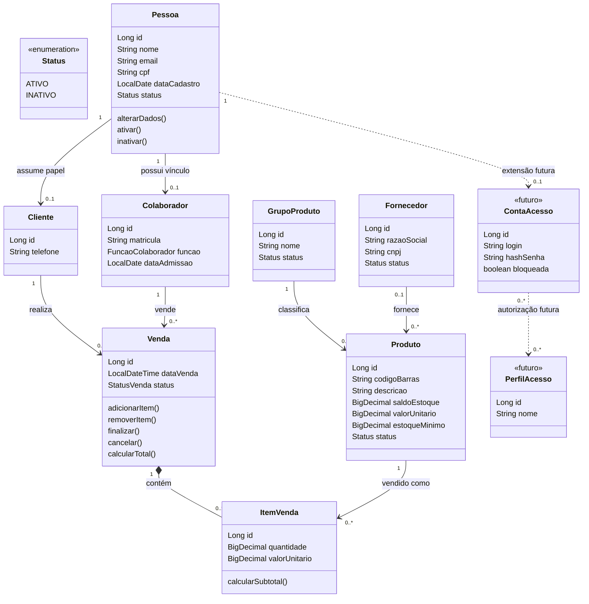
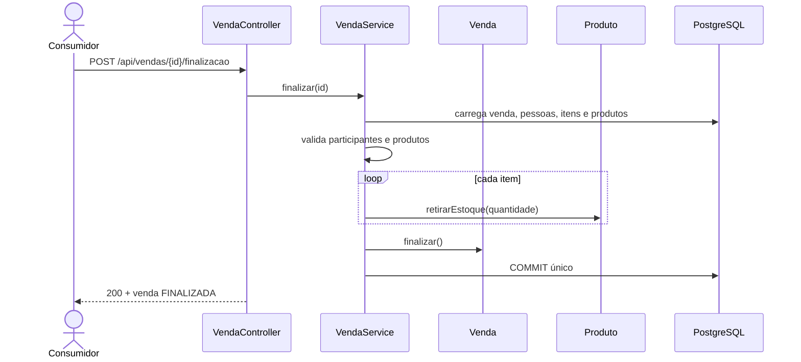

# Aula 10 — Evolução do domínio: pessoas, clientes, colaboradores, fornecedores e vendas

[⬅ Voltar para o índice do curso](../../README.md)

---

## Apresentação

Até a Aula 09, a aplicação controla grupos, fornecedores, produtos e estoque e publica seu contrato por OpenAPI. Esse modelo responde quais produtos existem e quanto há disponível, mas ainda não responde perguntas comerciais elementares:

- quem comprou;
- quem realizou a venda;
- quais produtos participaram de uma venda;
- qual preço foi praticado naquele momento;
- quando o estoque deve ser baixado;
- como representar alguém que é cliente e colaborador ao mesmo tempo;
- onde colocar CPF, CNPJ e, futuramente, credenciais de acesso.

Nesta aula evoluiremos o domínio sem implementar login. O modelo será preparado para que autenticação e autorização possam ser acrescentadas depois, sem transformar `Cliente` ou `Colaborador` em usuário do sistema por acidente.

### Problema orientador

> Como modelar pessoas e vendas preservando identidade, papéis, histórico comercial, integridade do estoque e espaço para uma futura camada de segurança?

### Entrega funcional

Ao final, a API permitirá:

- cadastrar uma `Pessoa` com CPF válido;
- associar essa pessoa ao papel de `Cliente` e/ou `Colaborador`;
- cadastrar fornecedor com CNPJ válido e vinculá-lo a produtos;
- abrir, consultar, filtrar, finalizar e cancelar vendas;
- adicionar e remover itens enquanto a venda estiver aberta;
- preservar o preço praticado em cada item;
- baixar todo o estoque na mesma transação ao finalizar;
- consultar o contrato atualizado no Swagger UI e no Postman.

### Fora do escopo

Ainda não implementaremos senha, login, token, perfis de autorização, estorno de venda finalizada nem controle de concorrência sobre o estoque. Essas ausências são decisões de recorte, não indicação de que seriam desnecessárias em produção.

---

## Resultados de aprendizagem

Ao concluir a aula, o estudante deverá ser capaz de:

1. diferenciar identidade civil, papel de negócio, função profissional e perfil de acesso;
2. explicar herança, substituição e composição, justificando a decisão adotada;
3. modelar uma relação muitos-para-muitos que possui atributos próprios;
4. validar os dígitos verificadores de CPF e CNPJ;
5. aplicar validação na entrada e no domínio;
6. criar migrações incrementais com chaves, unicidade e `CHECK`;
7. preservar preço histórico em um item de venda;
8. coordenar baixa de vários itens em uma transação atômica;
9. publicar endpoints REST com DTOs, filtros e paginação;
10. testar invariantes puras e casos de uso integrados ao PostgreSQL;
11. explicar como o modelo atual receberá segurança sem acoplá-la ao domínio comercial.

---

## Pré-requisitos e ponto inicial

- projeto no ponto de quebra da Aula 09;
- Java 21 e Docker Desktop;
- bancos `suporteos2026_dev` e `suporteos2026_test` disponíveis;
- `.env` local preenchido e ignorado pelo Git;
- compreensão de entidades JPA, DTOs, services, transações, Liquibase e OpenAPI;
- testes da Aula 09 aprovados.

Antes de editar:

```bash
git status
./mvnw test
```

No Windows:

```powershell
git status
.\mvnw.cmd test
```

Registre qualquer falha anterior. Uma evolução de modelo não deve esconder um defeito que já existia.

---

## 1. Ler o domínio antes de escolher classes

As frases do negócio sugerem responsabilidades diferentes:

| Frase | Conceito identificado |
|---|---|
| uma pessoa possui CPF, nome e e-mail | identidade civil |
| uma pessoa pode comprar | papel `Cliente` |
| uma pessoa pode trabalhar na empresa | papel `Colaborador` |
| um colaborador exerce uma função | função de negócio |
| uma venda possui produtos, quantidades e preços | associação com atributos |
| um fornecedor possui CNPJ | identidade da pessoa jurídica |
| futuramente alguém poderá entrar no sistema | conta de acesso, ainda ausente |

O modelo não deve começar por uma árvore de classes. Primeiro identificamos identidades, papéis, fatos históricos e regras; depois escolhemos os recursos da linguagem.

---

## 2. Diagrama de classes da aplicação



Leitura textual: `Pessoa` centraliza CPF, nome, e-mail e status. `Cliente` e `Colaborador` referenciam uma pessoa; não são subclasses. Uma venda pertence a um cliente e registra o colaborador vendedor. `ItemVenda` pertence à venda e aponta para o produto, guardando quantidade e preço praticado. `Fornecedor` continua sendo uma entidade separada, pois representa pessoa jurídica identificada por CNPJ.

As classes tracejadas são apenas uma direção futura. Elas não serão criadas nesta aula.

---

## 3. Herança: conceito, utilidade e risco

### 3.1 O que é herança

Em Java, herança permite que uma classe especializada receba estado e comportamento de uma classe base:

```java
class Pessoa { }
class Cliente extends Pessoa { }
```

Ela representa uma relação do tipo “é um” e cria substituição: onde o programa espera `Pessoa`, deve ser possível usar um `Cliente` sem quebrar as expectativas. Essa propriedade se relaciona ao Princípio da Substituição de Liskov.

Herança não é obsoleta nem proibida. Ela funciona bem quando:

- existe uma abstração estável;
- os subtipos respeitam o contrato completo da classe base;
- a substituição é útil para o comportamento do sistema;
- a hierarquia não muda a cada nova regra de negócio.

### 3.2 Por que não usar herança aqui

Uma pessoa real pode ser simultaneamente cliente e colaboradora. Com subclasses exclusivas, surgem perguntas difíceis:

- o objeto muda de classe quando o colaborador faz uma compra?
- seria necessário criar `ClienteColaborador extends ...`?
- CPF e e-mail seriam duplicados em duas linhas?
- como referenciar uma única identidade em uma futura conta?
- qual estratégia JPA representaria a mudança de papel sem migração complexa?

O problema é que cliente e colaborador são papéis que uma pessoa assume, e não espécies mutuamente exclusivas de pessoa.

### 3.3 Herança em JPA

JPA oferece estratégias como:

- `SINGLE_TABLE`: uma tabela para toda a hierarquia, com colunas vazias e discriminador;
- `JOINED`: tabela base e tabelas especializadas ligadas por chave;
- `TABLE_PER_CLASS`: uma tabela completa por classe concreta.

Todas podem ser corretas em outros domínios. Aqui acrescentariam acoplamento sem resolver bem os papéis simultâneos.

### 3.4 Abordagem escolhida: composição

Usaremos referências explícitas:

```java
class Cliente {
    private Pessoa pessoa;
}

class Colaborador {
    private Pessoa pessoa;
}
```

Vantagens observáveis:

- CPF e e-mail têm uma única origem;
- a pessoa pode possuir zero, um ou os dois papéis;
- cada papel mantém apenas dados próprios;
- novos papéis não multiplicam combinações de subclasses;
- uma futura conta referencia a identidade, não o papel comercial.

> “Prefira composição a herança” não é uma lei universal. É uma orientação para reduzir acoplamento quando o problema é participação, capacidade ou papel mutável, como neste caso.

---

## 4. Identidade, papel, função e permissão não são sinônimos

| Conceito | Exemplo | Pergunta respondida |
|---|---|---|
| Pessoa | Ana, CPF 529... | quem é? |
| Papel comercial | Cliente | como participa do negócio? |
| Vínculo | Colaborador | possui relação profissional? |
| Função | VENDEDOR | qual trabalho exerce? |
| Perfil de acesso futuro | OPERAR_VENDAS | o que pode fazer no sistema? |

Um gerente pode não possuir conta. Um vendedor pode possuir conta bloqueada. Um cliente pode futuramente acessar um portal com permissões diferentes. Portanto, `FuncaoColaborador.GERENTE` não equivale a uma autoridade de segurança.

Essa separação evita usar regras comerciais como mecanismo de autorização.

---

## 5. Relação muitos-para-muitos com atributos

Conceitualmente, uma venda possui muitos produtos e um produto aparece em muitas vendas. Um `@ManyToMany` direto esconderia informações essenciais da relação:

- quantidade vendida;
- preço praticado;
- subtotal;
- futuramente desconto, imposto ou lote.

Criamos então a entidade associativa `ItemVenda`:

```text
Venda 1 ─── N ItemVenda N ─── 1 Produto
```

Isso transforma a relação N:M em duas relações 1:N e dá identidade e comportamento ao item.

### Preço histórico

`ItemVenda.valorUnitario` recebe uma cópia do preço quando o item é incluído. Ele não consulta o preço atual ao calcular o total.

Exemplo: um caderno é vendido hoje por R$ 20,00 e passa a custar R$ 23,00 amanhã. A venda de hoje deve continuar totalizando R$ 20,00 por unidade.

---

## 6. CPF e CNPJ: formato não basta

Uma expressão regular consegue verificar quantidade de dígitos, mas não confirma os dígitos verificadores.

### CPF

O CPF contém nove dígitos-base e dois verificadores. Para o primeiro:

1. multiplique os nove dígitos pelos pesos de 10 a 2;
2. some os produtos;
3. calcule o resto da divisão por 11;
4. use zero se o resto for menor que 2; caso contrário, use `11 - resto`.

O segundo repete o processo incluindo o primeiro verificador, com pesos de 11 a 2. Sequências repetidas como `11111111111` são rejeitadas.

### CNPJ

O CNPJ possui doze dígitos-base e dois verificadores. Os pesos circulam de 9 a 2 conforme a posição. O mesmo critério de resto determina cada dígito. Sequências repetidas também não representam documentos válidos.

### Limite importante

O algoritmo verifica consistência matemática, não existência na Receita Federal nem titularidade. Não descreva essa validação como prova de que a pessoa ou empresa existe.

---

## 7. Mapeamento teoria–prática

| Ação | Conceito observado |
|---|---|
| criar `Pessoa` | identidade única e coesão |
| associar `Cliente` e `Colaborador` | composição e papéis simultâneos |
| criar `ItemVenda` | entidade associativa e N:M com atributos |
| copiar preço do produto | snapshot e histórico |
| validar CPF/CNPJ | invariante e defesa em profundidade |
| adicionar `005-...yaml` | evolução incremental do esquema |
| finalizar com `@Transactional` | atomicidade do caso de uso |
| filtrar vendas | consulta no banco e contrato paginado |
| propor `ContaAcesso` futura | separação de responsabilidades |

---

## 8. Passo 1 — Criar o validador fiscal no domínio

Crie `src/main/java/com/curso/suporteos/domain/DocumentoFiscal.java`.

```java
public final class DocumentoFiscal {
    private DocumentoFiscal() { }

    public static boolean cpfValido(String cpf) {
        if (cpf == null || !cpf.matches("\\d{11}") || digitosRepetidos(cpf)) {
            return false;
        }
        int primeiro = calcularDigito(cpf.substring(0, 9), 10);
        int segundo = calcularDigito(cpf.substring(0, 9) + primeiro, 11);
        return cpf.equals(cpf.substring(0, 9) + primeiro + segundo);
    }

    public static boolean cnpjValido(String cnpj) {
        if (cnpj == null || !cnpj.matches("\\d{14}") || digitosRepetidos(cnpj)) {
            return false;
        }
        int primeiro = calcularDigitoCnpj(cnpj.substring(0, 12));
        int segundo = calcularDigitoCnpj(cnpj.substring(0, 12) + primeiro);
        return cnpj.equals(cnpj.substring(0, 12) + primeiro + segundo);
    }

    private static int calcularDigito(String base, int pesoInicial) {
        int soma = 0;
        for (int indice = 0; indice < base.length(); indice++) {
            soma += Character.getNumericValue(base.charAt(indice))
                    * (pesoInicial - indice);
        }
        int resto = soma % 11;
        return resto < 2 ? 0 : 11 - resto;
    }

    private static int calcularDigitoCnpj(String base) {
        int peso = base.length() - 7;
        int soma = 0;
        for (int indice = 0; indice < base.length(); indice++) {
            soma += Character.getNumericValue(base.charAt(indice)) * peso;
            peso--;
            if (peso == 1) {
                peso = 9;
            }
        }
        int resto = soma % 11;
        return resto < 2 ? 0 : 11 - resto;
    }

    private static boolean digitosRepetidos(String valor) {
        return valor.chars().allMatch(digito -> digito == valor.charAt(0));
    }
}
```

A classe acima está completa. Ela não guarda estado e possui construtor privado para impedir instanciação sem sentido. Observe que o método público coordena a validação e os métodos privados isolam cada parte do algoritmo. Essa separação permite testar a regra por seus resultados sem expor detalhes desnecessários na API da classe.

### Verificação isolada

Crie `DocumentoFiscalTest` e confirme:

```java
assertTrue(DocumentoFiscal.cpfValido("52998224725"));
assertFalse(DocumentoFiscal.cpfValido("52998224724"));
assertTrue(DocumentoFiscal.cnpjValido("11222333000181"));
assertFalse(DocumentoFiscal.cnpjValido("11222333000182"));
```

Execute:

```bash
./mvnw -Dtest=DocumentoFiscalTest test
```

Resultado esperado: quatro decisões corretas e `BUILD SUCCESS`.

---

## 9. Passo 2 — Reutilizar a regra no Bean Validation

Crie as anotações `@CpfValido` e `@CnpjValido` em `api/validation`. Cada anotação aponta para um `ConstraintValidator`.

```java
public class CpfValidator implements ConstraintValidator<CpfValido, String> {
    @Override
    public boolean isValid(String value, ConstraintValidatorContext context) {
        return value == null || DocumentoFiscal.cpfValido(value);
    }
}
```

O `null` é aceito pelo validador específico porque obrigatoriedade pertence a `@NotBlank`. Separar as responsabilidades produz mensagens previsíveis.

No DTO:

```java
@NotBlank(message = "CPF é obrigatório")
@CpfValido
String cpf
```

No domínio, `Pessoa` chama novamente `DocumentoFiscal.cpfValido`. Essa repetição intencional protege a entidade quando ela é criada fora da API.

Atualize `FornecedorRequest` para usar `@CnpjValido` e `Fornecedor` para validar o documento no construtor. Produto já possui `fornecedor_id`; a associação continua opcional e é informada por `fornecedorId` nos DTOs de produto.

---

## 10. Passo 3 — Modelar Pessoa, Cliente e Colaborador

### Pessoa

Arquivo: `domain/Pessoa.java`.

Campos:

- `id`: identidade técnica;
- `nome`, `email`, `cpf`: identidade civil e contato;
- `dataCadastro`: controlada pelo servidor;
- `status`: controla participação em novas operações.

O e-mail é normalizado para minúsculas. O CPF é armazenado somente com dígitos. Nesta aula, a API exige esse formato em vez de remover pontuação silenciosamente; o contrato fica explícito.

### Cliente

Arquivo: `domain/Cliente.java`.

```java
@OneToOne(fetch = FetchType.LAZY, optional = false)
@JoinColumn(name = "pessoa_id", nullable = false, unique = true)
private Pessoa pessoa;

@Column(length = 30)
private String telefone;
```

A unicidade impede dois cadastros de cliente para a mesma pessoa.

### Colaborador

Arquivo: `domain/Colaborador.java`.

Além da pessoa, possui matrícula única, função e data de admissão. A enumeração inicial contém `VENDEDOR`, `ESTOQUISTA`, `GERENTE` e `ADMINISTRATIVO`.

Somente `VENDEDOR` e `GERENTE` podem constar como vendedor no caso de uso atual. Essa é uma regra comercial, não uma permissão de login.

### Conferência

Explique antes de avançar:

1. por que CPF não aparece em `Cliente` e `Colaborador`;
2. como uma pessoa pode possuir os dois papéis;
3. por que inativar a pessoa não apaga seu histórico.

---

## 11. Passo 4 — Modelar Venda e ItemVenda

`Venda` começa com status `ABERTA`. Apenas nesse estado aceita inclusão, remoção, finalização ou cancelamento.

```java
public ItemVenda adicionarItem(Produto produto, BigDecimal quantidade) {
    validarAberta();
    boolean repetido = itens.stream()
        .anyMatch(item -> Objects.equals(item.getProduto().getId(), produto.getId()));
    if (repetido) throw new IllegalArgumentException("Produto já incluído na venda");

    ItemVenda item = new ItemVenda(this, produto, quantidade,
            produto.getValorUnitario());
    itens.add(item);
    return item;
}
```

O preço é capturado aqui. Quantidade deve ser positiva. A restrição única `(venda_id, produto_id)` repete no banco a regra contra produto duplicado.

O total é derivado:

```java
public BigDecimal calcularTotal() {
    return itens.stream()
        .map(ItemVenda::calcularSubtotal)
        .reduce(BigDecimal.ZERO, BigDecimal::add)
        .setScale(2, RoundingMode.HALF_UP);
}
```

Não criamos uma coluna `total` nesta etapa. Isso evita sincronizar um valor que pode ser calculado a partir dos itens. Em sistemas com requisitos de auditoria ou desempenho, guardar o total pode ser justificável, desde que haja estratégia explícita de consistência.

---

## 12. Passo 5 — Criar a migração 005

Crie `src/main/resources/db/changelog/changes/005-pessoas-clientes-vendas.yaml` e inclua-o no master.

A migração cria:

1. `pessoa`, com unicidade de CPF e de e-mail normalizado;
2. `cliente`, com FK e unicidade de `pessoa_id`;
3. `colaborador`, com FK e unicidade de pessoa e matrícula;
4. `venda`, com FKs para cliente e vendedor;
5. `item_venda`, com FKs para venda e produto;
6. restrições `CHECK` para status, função, quantidade e preço.

Exemplo da integridade do item:

```yaml
- addUniqueConstraint:
    tableName: item_venda
    columnNames: venda_id, produto_id
    constraintName: uk_item_venda_produto
```

E da regra quantitativa:

```sql
ALTER TABLE item_venda
ADD CONSTRAINT ck_item_venda_quantidade
CHECK (quantidade > 0)
```

### Por que o banco não recalcula CPF/CNPJ

O banco garante formato e unicidade; a aplicação valida os dígitos. Implementar o algoritmo também no PostgreSQL duplicaria uma regra extensa nesta etapa. Em um sistema com múltiplos gravadores independentes, uma função ou domínio SQL poderia ser considerado.

### Aplicar e inspecionar

```bash
./mvnw spring-boot:run -Dspring-boot.run.profiles=dev
```

Verifique o log do Liquibase. Não edite um changeset já aplicado; corrija antes de versionar ou crie um novo changeset se ele já tiver sido compartilhado.

---

## 13. Passo 6 — Repositories e carregamento de relações

Crie repositories para as quatro novas raízes consultadas. `PessoaRepository` verifica CPF e e-mail duplicados. Cliente e colaborador usam `@EntityGraph(attributePaths = "pessoa")` para mapear a resposta fora da transação sem depender de Open Session in View.

Venda por ID precisa de participantes, pessoas, itens e produtos:

```java
@EntityGraph(attributePaths = {
    "cliente.pessoa", "vendedor.pessoa", "itens.produto"
})
Optional<Venda> findOneById(Long id);
```

Na pesquisa paginada, não carregamos a coleção de itens. Fazer `join fetch` de coleção com paginação pode multiplicar linhas e comprometer a contagem. A listagem retorna um resumo; o detalhe por ID retorna os itens.

---

## 14. Passo 7 — Services e transações

### Pessoas e papéis

`PessoaService` verifica duplicidade antes de salvar e também depende das restrições do banco para proteger contra corridas. `ClienteService` e `ColaboradorService` exigem pessoa ativa e impedem repetir o mesmo papel.

### Venda

O fluxo recomendado é:



Trecho central:

```java
@Transactional
public Venda finalizar(Long id) {
    Venda venda = buscarEntidade(id);
    validarParticipantes(venda.getCliente(), venda.getVendedor());
    for (ItemVenda item : venda.getItens()) {
        if (item.getProduto().getStatus() != Status.ATIVO) {
            throw new IllegalArgumentException(
                "Todos os produtos da venda devem estar ativos");
        }
        item.getProduto().retirarEstoque(item.getQuantidade());
    }
    venda.finalizar();
    return venda;
}
```

Se o terceiro item falhar por saldo insuficiente, a exceção faz rollback das baixas anteriores. Atomicidade significa “tudo ou nada” dentro da transação.

> Limite: duas transações concorrentes ainda podem ler o mesmo saldo e competir. Lock otimista ou pessimista será uma evolução posterior.

---

## 15. Passo 8 — DTOs, mapeadores e API REST

Não exponha entidades JPA diretamente. Os principais contratos são:

- `PessoaRequest` e `PessoaResponse`;
- `ClienteRequest`, `ClienteAtualizacaoRequest` e `ClienteResponse`;
- `ColaboradorRequest`, `ColaboradorAtualizacaoRequest` e `ColaboradorResponse`;
- `VendaRequest`, `ItemVendaRequest`, `VendaResponse` e `VendaResumoResponse`.

### Operações resultantes

| Método e caminho | Efeito |
|---|---|
| `POST /api/pessoas` | cria identidade com CPF |
| `GET /api/pessoas/{id}` | carrega identidade |
| `GET /api/pessoas` | pesquisa paginada |
| `PUT /api/pessoas/{id}` | substitui campos editáveis |
| `PUT /api/pessoas/{id}/status` | ativa/inativa |
| `POST /api/clientes` | associa papel de cliente |
| `GET /api/clientes/{id}` | consulta cliente |
| `GET /api/clientes` | pesquisa cliente |
| `PUT /api/clientes/{id}` | altera telefone |
| `POST /api/colaboradores` | cria vínculo profissional |
| `GET /api/colaboradores/{id}` | consulta colaborador |
| `GET /api/colaboradores` | pesquisa colaborador |
| `PUT /api/colaboradores/{id}` | altera matrícula e função |
| `POST /api/vendas` | abre venda |
| `GET /api/vendas/{id}` | consulta venda completa |
| `GET /api/vendas` | pesquisa resumos |
| `POST /api/vendas/{id}/itens` | adiciona item |
| `DELETE /api/vendas/{vendaId}/itens/{itemId}` | remove item aberto |
| `POST /api/vendas/{id}/finalizacao` | baixa estoque e finaliza |
| `POST /api/vendas/{id}/cancelamento` | cancela venda aberta |

Usamos `POST` para finalização porque é um comando de negócio, não substituição integral do recurso. Repetir a chamada não repete a baixa: a segunda tentativa falha, pois a venda não está mais aberta.

### 15.1 Ordem de implementação e dependências entre arquivos

Implemente na ordem abaixo. Ela evita criar controllers que ainda não possuem tipos de domínio ou services disponíveis.

```text
1. domain/DocumentoFiscal
2. api/validation/CpfValido, CpfValidator, CnpjValido, CnpjValidator
3. domain/Pessoa, Cliente, Colaborador, FuncaoColaborador
4. domain/Venda, ItemVenda, StatusVenda
5. db/changelog/changes/005-pessoas-clientes-vendas.yaml
6. repository/PessoaRepository, ClienteRepository,
   ColaboradorRepository, VendaRepository
7. application/PessoaService, ClienteService,
   ColaboradorService, VendaService
8. api/dto/*
9. api/mapper/*
10. api/controller/*
11. testes, OpenAPI e Postman
```

Depois de cada grupo, execute pelo menos `./mvnw -DskipTests compile`. Não espere terminar todas as camadas para descobrir um import, construtor ou tipo incorreto.

### 15.2 Implementar as anotações de CPF e CNPJ

Crie `src/main/java/com/curso/suporteos/api/validation/CpfValido.java`:

```java
package com.curso.suporteos.api.validation;

import jakarta.validation.Constraint;
import jakarta.validation.Payload;
import java.lang.annotation.ElementType;
import java.lang.annotation.Retention;
import java.lang.annotation.RetentionPolicy;
import java.lang.annotation.Target;

@Target({ElementType.FIELD, ElementType.PARAMETER,
        ElementType.RECORD_COMPONENT})
@Retention(RetentionPolicy.RUNTIME)
@Constraint(validatedBy = CpfValidator.class)
public @interface CpfValido {
    String message() default "CPF inválido";
    Class<?>[] groups() default {};
    Class<? extends Payload>[] payload() default {};
}
```

Crie `CpfValidator.java` no mesmo pacote:

```java
package com.curso.suporteos.api.validation;

import com.curso.suporteos.domain.DocumentoFiscal;
import jakarta.validation.ConstraintValidator;
import jakarta.validation.ConstraintValidatorContext;

public class CpfValidator implements ConstraintValidator<CpfValido, String> {
    @Override
    public boolean isValid(String value,
                           ConstraintValidatorContext context) {
        return value == null || DocumentoFiscal.cpfValido(value);
    }
}
```

Crie `CnpjValido.java` completo:

```java
package com.curso.suporteos.api.validation;

import jakarta.validation.Constraint;
import jakarta.validation.Payload;
import java.lang.annotation.ElementType;
import java.lang.annotation.Retention;
import java.lang.annotation.RetentionPolicy;
import java.lang.annotation.Target;

@Target({ElementType.FIELD, ElementType.PARAMETER,
        ElementType.RECORD_COMPONENT})
@Retention(RetentionPolicy.RUNTIME)
@Constraint(validatedBy = CnpjValidator.class)
public @interface CnpjValido {
    String message() default "CNPJ inválido";
    Class<?>[] groups() default {};
    Class<? extends Payload>[] payload() default {};
}
```

Crie `CnpjValidator.java`:

```java
package com.curso.suporteos.api.validation;

import com.curso.suporteos.domain.DocumentoFiscal;
import jakarta.validation.ConstraintValidator;
import jakarta.validation.ConstraintValidatorContext;

public class CnpjValidator
        implements ConstraintValidator<CnpjValido, String> {
    @Override
    public boolean isValid(String value,
                           ConstraintValidatorContext context) {
        return value == null || DocumentoFiscal.cnpjValido(value);
    }
}
```

As anotações precisam de `@Retention(RUNTIME)` porque a validação ocorre durante a execução. `@Constraint` liga a anotação ao algoritmo. `RECORD_COMPONENT` permite aplicá-la diretamente aos componentes dos DTOs `record`.

Ponto de conferência:

```bash
./mvnw -DskipTests compile
```

Se aparecer “cannot find symbol CpfValidator”, confirme pacote, nome da classe e o valor de `validatedBy`.

### 15.3 Construir `Pessoa` por etapas

Comece pelo cabeçalho e pelos campos de `domain/Pessoa.java`:

```java
@Entity
@Table(name = "pessoa")
public class Pessoa {
    @Id
    @GeneratedValue(strategy = GenerationType.IDENTITY)
    private Long id;

    @Column(nullable = false, length = 150)
    private String nome;

    @Column(nullable = false, length = 180)
    private String email;

    @Column(nullable = false, length = 11, unique = true)
    private String cpf;

    @Column(name = "data_cadastro", nullable = false)
    private LocalDate dataCadastro;

    @Enumerated(EnumType.STRING)
    @Column(nullable = false, length = 20)
    private Status status;

    protected Pessoa() { }
}
```

O construtor sem argumentos é exigido pelo JPA e permanece `protected` para não ser a forma normal de criar a entidade. Acrescente o construtor de negócio:

```java
public Pessoa(String nome, String email, String cpf,
              LocalDate dataCadastro) {
    this.nome = validarTextoObrigatorio(nome, "Nome é obrigatório");
    this.email = normalizarEmail(email);
    this.cpf = validarCpf(cpf);
    this.dataCadastro = Objects.requireNonNull(
            dataCadastro, "Data de cadastro é obrigatória");
    this.status = Status.ATIVO;
}
```

Depois acrescente comportamento e validações:

```java
public void alterarDados(String nome, String email, String cpf) {
    this.nome = validarTextoObrigatorio(nome, "Nome é obrigatório");
    this.email = normalizarEmail(email);
    this.cpf = validarCpf(cpf);
}

public void ativar() { this.status = Status.ATIVO; }
public void inativar() { this.status = Status.INATIVO; }

private static String normalizarEmail(String email) {
    String valor = validarTextoObrigatorio(
            email, "E-mail é obrigatório").toLowerCase(Locale.ROOT);
    if (!valor.matches("^[^@\\s]+@[^@\\s]+\\.[^@\\s]+$")) {
        throw new IllegalArgumentException("E-mail inválido");
    }
    return valor;
}

private static String validarCpf(String cpf) {
    String valor = validarTextoObrigatorio(cpf, "CPF é obrigatório");
    if (!DocumentoFiscal.cpfValido(valor)) {
        throw new IllegalArgumentException("CPF inválido");
    }
    return valor;
}

private static String validarTextoObrigatorio(
        String texto, String mensagem) {
    if (texto == null || texto.isBlank()) {
        throw new IllegalArgumentException(mensagem);
    }
    return texto.trim();
}
```

Finalize com getters. Não crie setters genéricos: `alterarDados`, `ativar` e `inativar` tornam as transições explícitas e mantêm as validações centralizadas.

### 15.4 Criar os papéis por composição

Em `Cliente`, a pessoa é obrigatória e única:

```java
@Entity
@Table(name = "cliente",
       uniqueConstraints = @UniqueConstraint(
           name = "uk_cliente_pessoa", columnNames = "pessoa_id"))
public class Cliente {
    @Id
    @GeneratedValue(strategy = GenerationType.IDENTITY)
    private Long id;

    @OneToOne(fetch = FetchType.LAZY, optional = false)
    @JoinColumn(name = "pessoa_id", nullable = false, unique = true,
            foreignKey = @ForeignKey(name = "fk_cliente_pessoa"))
    private Pessoa pessoa;

    @Column(length = 30)
    private String telefone;

    protected Cliente() { }

    public Cliente(Pessoa pessoa, String telefone) {
        this.pessoa = Objects.requireNonNull(
                pessoa, "Pessoa é obrigatória");
        this.telefone = normalizarOpcional(telefone);
    }

    public void alterarDados(String telefone) {
        this.telefone = normalizarOpcional(telefone);
    }

    private static String normalizarOpcional(String texto) {
        return texto == null || texto.isBlank() ? null : texto.trim();
    }
}
```

Crie a enumeração `FuncaoColaborador.java`:

```java
public enum FuncaoColaborador {
    VENDEDOR,
    ESTOQUISTA,
    GERENTE,
    ADMINISTRATIVO
}
```

`Colaborador` repete a associação com `Pessoa`, mas acrescenta seus próprios atributos:

```java
@OneToOne(fetch = FetchType.LAZY, optional = false)
@JoinColumn(name = "pessoa_id", nullable = false, unique = true,
        foreignKey = @ForeignKey(name = "fk_colaborador_pessoa"))
private Pessoa pessoa;

@Column(nullable = false, length = 30)
private String matricula;

@Enumerated(EnumType.STRING)
@Column(nullable = false, length = 30)
private FuncaoColaborador funcao;

@Column(name = "data_admissao", nullable = false)
private LocalDate dataAdmissao;
```

Seu construtor deve exigir os quatro valores. O método `alterarDados` modifica apenas matrícula e função; pessoa e data de admissão identificam o vínculo criado e não são substituídas pelo `PUT` desta aula.

Ponto de conferência conceitual: nenhuma dessas classes usa `extends Pessoa`. O relacionamento aparece como FK `pessoa_id`, permitindo uma linha em `cliente` e outra em `colaborador` apontarem para a mesma pessoa.

### 15.5 Implementar os estados e a entidade associativa

Crie `StatusVenda.java`:

```java
public enum StatusVenda {
    ABERTA,
    FINALIZADA,
    CANCELADA
}
```

Em `ItemVenda`, mapeie as duas extremidades da associação:

```java
@Entity
@Table(name = "item_venda",
       uniqueConstraints = @UniqueConstraint(
           name = "uk_item_venda_produto",
           columnNames = {"venda_id", "produto_id"}))
public class ItemVenda {
    @Id
    @GeneratedValue(strategy = GenerationType.IDENTITY)
    private Long id;

    @ManyToOne(fetch = FetchType.LAZY, optional = false)
    @JoinColumn(name = "venda_id", nullable = false)
    private Venda venda;

    @ManyToOne(fetch = FetchType.LAZY, optional = false)
    @JoinColumn(name = "produto_id", nullable = false)
    private Produto produto;

    @Column(nullable = false, precision = 18, scale = 3)
    private BigDecimal quantidade;

    @Column(name = "valor_unitario", nullable = false,
            precision = 18, scale = 2)
    private BigDecimal valorUnitario;

    protected ItemVenda() { }

    ItemVenda(Venda venda, Produto produto, BigDecimal quantidade,
              BigDecimal valorUnitario) {
        this.venda = Objects.requireNonNull(venda, "Venda é obrigatória");
        this.produto = Objects.requireNonNull(produto, "Produto é obrigatório");
        this.quantidade = validarPositivo(quantidade);
        this.valorUnitario = validarNaoNegativo(valorUnitario);
    }

    public BigDecimal calcularSubtotal() {
        return quantidade.multiply(valorUnitario)
                .setScale(2, RoundingMode.HALF_UP);
    }
}
```

O construtor possui visibilidade de pacote: itens devem nascer por `Venda.adicionarItem`, não isoladamente. Implemente os validadores verificando `null`, `signum()` e lançando `IllegalArgumentException` com mensagem objetiva.

Em `Venda`, o mapeamento da coleção define a venda como responsável pelo ciclo de vida dos itens:

```java
@OneToMany(mappedBy = "venda", cascade = CascadeType.ALL,
        orphanRemoval = true)
@OrderBy("id ASC")
private List<ItemVenda> itens = new ArrayList<>();
```

- `cascade = ALL`: persistir a venda também persiste seus novos itens;
- `orphanRemoval = true`: remover o item da coleção remove sua linha;
- `mappedBy`: informa que a FK está no lado `ItemVenda.venda`;
- `@OrderBy`: estabiliza a ordem apresentada na resposta.

Acrescente as transições completas:

```java
public void removerItem(Long itemId) {
    validarAberta();
    boolean removido = itens.removeIf(
            item -> Objects.equals(item.getId(), itemId));
    if (!removido) {
        throw new IllegalArgumentException("Item não pertence à venda");
    }
}

public void finalizar() {
    validarAberta();
    if (itens.isEmpty()) {
        throw new IllegalArgumentException(
                "Venda deve possuir ao menos um item");
    }
    status = StatusVenda.FINALIZADA;
}

public void cancelar() {
    validarAberta();
    status = StatusVenda.CANCELADA;
}

private void validarAberta() {
    if (status != StatusVenda.ABERTA) {
        throw new IllegalStateException(
                "Somente vendas abertas podem ser alteradas");
    }
}
```

### 15.6 Escrever a migração sem depender do Hibernate

No início de `005-pessoas-clientes-vendas.yaml`, use a mesma estrutura das migrações anteriores:

```yaml
databaseChangeLog:
  - changeSet:
      id: 005-01-create-pessoa
      author: curso-spring-2026
      changes:
        - createTable:
            tableName: pessoa
            columns:
              - column:
                  name: id
                  type: BIGINT
                  autoIncrement: true
                  constraints:
                    primaryKey: true
                    primaryKeyName: pk_pessoa
                    nullable: false
              - column:
                  name: nome
                  type: VARCHAR(150)
                  constraints:
                    nullable: false
              - column:
                  name: email
                  type: VARCHAR(180)
                  constraints:
                    nullable: false
              - column:
                  name: cpf
                  type: VARCHAR(11)
                  constraints:
                    nullable: false
              - column:
                  name: data_cadastro
                  type: DATE
                  constraints:
                    nullable: false
              - column:
                  name: status
                  type: VARCHAR(20)
                  constraints:
                    nullable: false
```

Crie changeSets separados para unicidade e checks. Isso melhora a leitura e o rollback:

```yaml
  - changeSet:
      id: 005-03-unique-cpf-pessoa
      author: curso-spring-2026
      changes:
        - addUniqueConstraint:
            tableName: pessoa
            columnNames: cpf
            constraintName: uk_pessoa_cpf

  - changeSet:
      id: 005-04-check-pessoa
      author: curso-spring-2026
      changes:
        - sql:
            sql: >
              ALTER TABLE pessoa
              ADD CONSTRAINT ck_pessoa_cpf_formato
              CHECK (cpf ~ '^[0-9]{11}$')
```

Para as demais tabelas, use esta especificação como checklist antes de escrever o YAML:

| Tabela | Colunas próprias | Restrições |
|---|---|---|
| `cliente` | `id`, `pessoa_id`, `telefone` | pessoa obrigatória, FK e única |
| `colaborador` | `id`, `pessoa_id`, `matricula`, `funcao`, `data_admissao` | pessoa e matrícula únicas; função em enumeração |
| `venda` | `id`, `cliente_id`, `vendedor_id`, `data_venda`, `status` | duas FKs; status permitido |
| `item_venda` | `id`, `venda_id`, `produto_id`, `quantidade`, `valor_unitario` | FKs; par venda/produto único; quantidade positiva |

Use `ON DELETE RESTRICT` para pessoa, participantes e produto. Use `ON DELETE CASCADE` somente de venda para item: um item não possui significado fora de sua venda, enquanto um produto vendido precisa permanecer no histórico.

Por fim, inclua o arquivo no master:

```yaml
  - include:
      file: db/changelog/changes/005-pessoas-clientes-vendas.yaml
```

Compare seu arquivo com a especificação, execute a aplicação e só então prossiga. Se Hibernate informar coluna ausente, não ative `ddl-auto=update`; corrija a migração.

### 15.7 Criar repositories com métodos derivados e entity graphs

`PessoaRepository.java`:

```java
public interface PessoaRepository extends
        JpaRepository<Pessoa, Long>,
        JpaSpecificationExecutor<Pessoa> {
    boolean existsByCpf(String cpf);
    boolean existsByCpfAndIdNot(String cpf, Long id);
    boolean existsByEmailIgnoreCase(String email);
    boolean existsByEmailIgnoreCaseAndIdNot(String email, Long id);
}
```

`ClienteRepository.java`:

```java
public interface ClienteRepository extends
        JpaRepository<Cliente, Long>,
        JpaSpecificationExecutor<Cliente> {
    boolean existsByPessoaId(Long pessoaId);

    @EntityGraph(attributePaths = "pessoa")
    Optional<Cliente> findOneById(Long id);

    @Override
    @EntityGraph(attributePaths = "pessoa")
    Page<Cliente> findAll(Specification<Cliente> specification,
                          Pageable pageable);
}
```

`ColaboradorRepository` segue o mesmo padrão e acrescenta:

```java
boolean existsByMatricula(String matricula);
boolean existsByMatriculaAndIdNot(String matricula, Long id);
```

`VendaRepository.java` diferencia detalhe e página:

```java
public interface VendaRepository extends
        JpaRepository<Venda, Long>,
        JpaSpecificationExecutor<Venda> {

    @EntityGraph(attributePaths = {
        "cliente.pessoa", "vendedor.pessoa", "itens.produto"
    })
    Optional<Venda> findOneById(Long id);

    @Override
    @EntityGraph(attributePaths = {
        "cliente.pessoa", "vendedor.pessoa"
    })
    Page<Venda> findAll(Specification<Venda> specification,
                        Pageable pageable);
}
```

### 15.8 Implementar services começando pelas regras, não pelo controller

Em `PessoaService.cadastrar`, valide unicidade antes de salvar:

```java
@Transactional
public Pessoa cadastrar(Pessoa pessoa) {
    validarUnicidade(pessoa.getCpf(), pessoa.getEmail(), null);
    return repository.save(pessoa);
}

private void validarUnicidade(String cpf, String email, Long idAtual) {
    boolean cpfDuplicado = idAtual == null
            ? repository.existsByCpf(cpf)
            : repository.existsByCpfAndIdNot(cpf, idAtual);
    boolean emailDuplicado = idAtual == null
            ? repository.existsByEmailIgnoreCase(email)
            : repository.existsByEmailIgnoreCaseAndIdNot(email, idAtual);

    if (cpfDuplicado) {
        throw new RecursoDuplicadoException("CPF já cadastrado");
    }
    if (emailDuplicado) {
        throw new RecursoDuplicadoException("E-mail já cadastrado");
    }
}
```

Na alteração, passe o próprio ID aos métodos `...AndIdNot`; caso contrário, o registro seria considerado duplicado dele mesmo.

`ClienteService.cadastrar` demonstra a criação de um papel:

```java
@Transactional
public Cliente cadastrar(Long pessoaId, String telefone) {
    Pessoa pessoa = pessoaRepository.findById(pessoaId)
        .orElseThrow(() -> new RecursoNaoEncontradoException(
                "Pessoa não encontrada"));

    if (pessoa.getStatus() != Status.ATIVO) {
        throw new IllegalArgumentException("Pessoa deve estar ativa");
    }
    if (repository.existsByPessoaId(pessoaId)) {
        throw new RecursoDuplicadoException(
                "Pessoa já possui cadastro de cliente");
    }
    return repository.save(new Cliente(pessoa, telefone));
}
```

`ColaboradorService` repete as verificações de pessoa e acrescenta matrícula única. Não copie sem analisar: a mensagem e o método de repository precisam representar a regra específica.

Em `VendaService`, implemente cada caso de uso separadamente:

```java
@Transactional
public Venda cadastrar(Long clienteId, Long vendedorId) {
    Cliente cliente = buscarCliente(clienteId);
    Colaborador vendedor = buscarVendedor(vendedorId);
    validarParticipantes(cliente, vendedor);
    return repository.save(
            new Venda(cliente, vendedor, LocalDateTime.now()));
}

@Transactional
public Venda adicionarItem(Long vendaId, Long produtoId,
                           BigDecimal quantidade) {
    Venda venda = buscarEntidade(vendaId);
    Produto produto = produtoRepository
            .buscarPorIdComRelacionamentos(produtoId)
            .orElseThrow(() -> new RecursoNaoEncontradoException(
                    "Produto não encontrado"));
    if (produto.getStatus() != Status.ATIVO) {
        throw new IllegalArgumentException("Produto deve estar ativo");
    }
    venda.adicionarItem(produto, quantidade);
    return venda;
}

@Transactional
public Venda removerItem(Long vendaId, Long itemId) {
    Venda venda = buscarEntidade(vendaId);
    venda.removerItem(itemId);
    return venda;
}

@Transactional
public Venda cancelar(Long id) {
    Venda venda = buscarEntidade(id);
    venda.cancelar();
    return venda;
}
```

Não chame `save` depois de cada mudança em entidade gerenciada. Dentro da transação, o dirty checking detecta as alterações. O `save` na abertura é necessário porque a venda ainda é nova.

### 15.9 Construir filtros incrementais com `Specification`

Comece sempre com uma conjunção verdadeira:

```java
Specification<Venda> filtros =
        (root, query, cb) -> cb.conjunction();
```

Acrescente somente os parâmetros recebidos:

```java
if (status != null) {
    filtros = filtros.and((root, query, cb) ->
            cb.equal(root.get("status"), status));
}
if (clienteId != null) {
    filtros = filtros.and((root, query, cb) ->
            cb.equal(root.get("cliente").get("id"), clienteId));
}
if (dataInicial != null) {
    filtros = filtros.and((root, query, cb) ->
            cb.greaterThanOrEqualTo(
                    root.get("dataVenda"), dataInicial.atStartOfDay()));
}
if (dataFinal != null) {
    filtros = filtros.and((root, query, cb) ->
            cb.lessThan(root.get("dataVenda"),
                    dataFinal.plusDays(1).atStartOfDay()));
}
```

Usar o início do dia seguinte com `<` inclui todo o último dia, inclusive horários com frações de segundo. Antes de consultar, rejeite intervalo invertido e valide os campos permitidos de ordenação (`id`, `dataVenda`, `status`).

### 15.10 Definir DTOs antes de mapear respostas

Crie `PessoaRequest.java`:

```java
public record PessoaRequest(
    @NotBlank @Size(max = 150) String nome,
    @NotBlank @Email @Size(max = 180) String email,
    @NotBlank @CpfValido String cpf) { }
```

Crie `ItemVendaRequest.java`:

```java
public record ItemVendaRequest(
    @NotNull Long produtoId,
    @NotNull
    @DecimalMin(value = "0.001")
    @Digits(integer = 15, fraction = 3)
    BigDecimal quantidade) { }
```

Os DTOs de resposta da venda devem ser separados em detalhe e resumo:

```java
public record ItemVendaResponse(
    Long id,
    Long produtoId,
    String produtoDescricao,
    BigDecimal quantidade,
    BigDecimal valorUnitario,
    BigDecimal subtotal) { }

public record VendaResponse(
    Long id,
    Long clienteId,
    String clienteNome,
    Long vendedorId,
    String vendedorNome,
    LocalDateTime dataVenda,
    StatusVenda status,
    List<ItemVendaResponse> itens,
    BigDecimal total) { }

public record VendaResumoResponse(
    Long id,
    Long clienteId,
    String clienteNome,
    Long vendedorId,
    String vendedorNome,
    LocalDateTime dataVenda,
    StatusVenda status) { }
```

O resumo não possui itens nem total calculado. Assim, `GET /api/vendas` pagina vendas sem carregar uma coleção para cada linha. `GET /api/vendas/{id}` oferece a representação completa.

### 15.11 Mapear explicitamente entidade para contrato

Crie `VendaMapper.java`:

```java
@Component
public class VendaMapper {
    public VendaResponse toResponse(Venda venda) {
        List<ItemVendaResponse> itens = venda.getItens().stream()
                .map(this::toItemResponse)
                .toList();

        return new VendaResponse(
                venda.getId(),
                venda.getCliente().getId(),
                venda.getCliente().getPessoa().getNome(),
                venda.getVendedor().getId(),
                venda.getVendedor().getPessoa().getNome(),
                venda.getDataVenda(),
                venda.getStatus(),
                itens,
                venda.calcularTotal());
    }

    public VendaResumoResponse toResumo(Venda venda) {
        return new VendaResumoResponse(
                venda.getId(),
                venda.getCliente().getId(),
                venda.getCliente().getPessoa().getNome(),
                venda.getVendedor().getId(),
                venda.getVendedor().getPessoa().getNome(),
                venda.getDataVenda(),
                venda.getStatus());
    }

    private ItemVendaResponse toItemResponse(ItemVenda item) {
        return new ItemVendaResponse(
                item.getId(), item.getProduto().getId(),
                item.getProduto().getDescricao(), item.getQuantidade(),
                item.getValorUnitario(), item.calcularSubtotal());
    }
}
```

Se esse mapper produzir `LazyInitializationException`, o problema não deve ser “corrigido” ativando Open Session in View. Confira se o repository usado pelo caso de uso possui o `@EntityGraph` adequado.

### 15.12 Implementar os endpoints de venda

O núcleo de `VendaController.java` fica assim:

```java
@RestController
@RequestMapping("/api/vendas")
@Tag(name = "Vendas")
public class VendaController {
    private final VendaService service;
    private final VendaMapper mapper;

    public VendaController(VendaService service, VendaMapper mapper) {
        this.service = service;
        this.mapper = mapper;
    }

    @PostMapping
    public ResponseEntity<VendaResponse> cadastrar(
            @Valid @RequestBody VendaRequest request) {
        Venda venda = service.cadastrar(
                request.clienteId(), request.vendedorId());
        URI location = URI.create("/api/vendas/" + venda.getId());
        return ResponseEntity.created(location)
                .body(mapper.toResponse(venda));
    }

    @GetMapping("/{id}")
    public VendaResponse buscar(@PathVariable Long id) {
        return mapper.toResponse(service.buscarPorId(id));
    }

    @PostMapping("/{id}/itens")
    public VendaResponse adicionarItem(
            @PathVariable Long id,
            @Valid @RequestBody ItemVendaRequest request) {
        return mapper.toResponse(service.adicionarItem(
                id, request.produtoId(), request.quantidade()));
    }

    @DeleteMapping("/{vendaId}/itens/{itemId}")
    public VendaResponse removerItem(
            @PathVariable Long vendaId,
            @PathVariable Long itemId) {
        return mapper.toResponse(service.removerItem(vendaId, itemId));
    }

    @PostMapping("/{id}/finalizacao")
    public VendaResponse finalizar(@PathVariable Long id) {
        return mapper.toResponse(service.finalizar(id));
    }

    @PostMapping("/{id}/cancelamento")
    public VendaResponse cancelar(@PathVariable Long id) {
        return mapper.toResponse(service.cancelar(id));
    }
}
```

Acrescente o `GET` paginado usando os mesmos parâmetros do service. Anote cada operação com `@Operation` e documente `400`, `404` e `409` com `@ApiResponse`, conforme os controllers das Aulas 08 e 09.

Repita a mesma divisão de responsabilidades nos demais controllers:

| Controller | Recebe | Chama | Mapeia |
|---|---|---|---|
| `PessoaController` | dados civis e status | `PessoaService` | `PessoaMapper` |
| `ClienteController` | pessoa e telefone | `ClienteService` | `ClienteMapper` |
| `ColaboradorController` | pessoa, matrícula, função e admissão | `ColaboradorService` | `ColaboradorMapper` |
| `VendaController` | participantes, filtros e itens | `VendaService` | `VendaMapper` |

O controller não deve verificar saldo, função do vendedor ou duplicidade. Essas regras pertencem às entidades e aos services e precisam funcionar mesmo quando o caso de uso for chamado por outro adaptador.

### 15.13 Adequar o tratamento de estados inválidos

`Venda` usa `IllegalStateException` quando uma transição não é permitida. Inclua essa exceção no mesmo tratamento de regras inválidas:

```java
@ExceptionHandler({
    IllegalArgumentException.class,
    IllegalStateException.class
})
public ResponseEntity<ApiError> tratarRegraInvalida(
        RuntimeException exception,
        HttpServletRequest request) {
    return resposta(HttpStatus.BAD_REQUEST,
            exception.getMessage(), request, Map.of());
}
```

Sem essa alteração, tentar cancelar uma venda finalizada poderia escapar para a resposta genérica `500`, embora a situação seja uma violação previsível do contrato de negócio.

### 15.14 Conferência intermediária antes dos testes HTTP

Execute nesta ordem:

```bash
./mvnw -DskipTests compile
./mvnw -Dtest=DocumentoFiscalTest,PessoaTest,VendaTest test
./mvnw test
```

Interprete cada resultado:

- falha na compilação: contrato Java incoerente entre camadas;
- falha unitária: regra de domínio incorreta, sem culpar o banco;
- falha ao iniciar contexto: mapeamento ou migração incompatível;
- falha MockMvc: contrato HTTP diferente do esperado;
- falha de rollback: fronteira transacional incorreta.

---

## 16. Passo 9 — Executar um cenário completo

### 16.1 Criar pessoa

```bash
curl -i -X POST http://localhost:8080/api/pessoas \
  -H 'Content-Type: application/json' \
  -d '{"nome":"Ana Souza","email":"ana@example.com","cpf":"52998224725"}'
```

Resultado: `201 Created`, `Location` e pessoa `ATIVO`.

Troque o último dígito do CPF. Resultado esperado: `400` e erro associado a `cpf`.

### 16.2 Criar o papel de cliente

```bash
curl -i -X POST http://localhost:8080/api/clientes \
  -H 'Content-Type: application/json' \
  -d '{"pessoaId":1,"telefone":"(11) 99999-0000"}'
```

### 16.3 Criar a pessoa e o vínculo do vendedor

```bash
curl -i -X POST http://localhost:8080/api/pessoas \
  -H 'Content-Type: application/json' \
  -d '{"nome":"Bruno Lima","email":"bruno@example.com","cpf":"11144477735"}'

curl -i -X POST http://localhost:8080/api/colaboradores \
  -H 'Content-Type: application/json' \
  -d '{"pessoaId":2,"matricula":"VEN-001","funcao":"VENDEDOR","dataAdmissao":"2026-09-29"}'
```

### 16.4 Abrir e montar a venda

```bash
curl -i -X POST http://localhost:8080/api/vendas \
  -H 'Content-Type: application/json' \
  -d '{"clienteId":1,"vendedorId":1}'

curl -i -X POST http://localhost:8080/api/vendas/1/itens \
  -H 'Content-Type: application/json' \
  -d '{"produtoId":1,"quantidade":2.000}'
```

Observe `valorUnitario`, `subtotal` e `total` na resposta.

### 16.5 Finalizar

```bash
curl -i -X POST http://localhost:8080/api/vendas/1/finalizacao
```

Depois consulte a venda e o produto. A venda deve estar `FINALIZADA`; o saldo deve ter sido reduzido exatamente pela quantidade do item.

---

## 17. Passo 10 — Testar regra, persistência e contrato

### Teste de domínio

`VendaTest` altera o preço do produto depois de incluí-lo e confirma que o total histórico não muda.

### Teste de transação

`VendaServiceTest` cria dois itens e força saldo insuficiente no segundo. Depois da exceção, confirma que o saldo do primeiro permaneceu igual e que a venda continua aberta.

Esse teste prova algo que um teste isolado de `Produto` não prova: a coordenação transacional entre vários objetos persistidos.

### Teste OpenAPI

Atualize `OpenApiDocumentationTest` para procurar:

```text
/api/pessoas
/api/clientes/{id}
/api/colaboradores
/api/vendas/{id}/itens
/api/vendas/{id}/finalizacao
VendaResponse
```

### Suíte completa

```bash
./mvnw test
```

Não aceite apenas “a aplicação iniciou”. Confira total de testes, falhas, erros e testes ignorados.

---

## 18. Postman e contrato executável

Importe `postman/Suporte-OS.postman_collection.json`. A pasta da Aula 10:

- gera CPF e CNPJ matematicamente válidos;
- captura IDs de pessoa, cliente, colaborador, venda e item;
- executa inclusão, remoção e reinclusão de item;
- finaliza uma venda;
- abre e cancela outra;
- demonstra que um produto vendido não pode ser apagado.

O último comportamento preserva histórico: `ItemVenda` possui FK para `Produto`, com `ON DELETE RESTRICT`.

O Swagger UI deve apresentar os novos grupos `Pessoas`, `Clientes`, `Colaboradores` e `Vendas`. Compare exemplos e status com o comportamento real.

---

## 19. Ligação com segurança futura

A futura `ContaAcesso` poderá referenciar `Pessoa`:

```text
Pessoa 1 ─── 0..1 ContaAcesso N ─── N PerfilAcesso
```

Uma implementação posterior deverá tratar, entre outros pontos:

- senha somente como hash produzido por `PasswordEncoder`;
- login único;
- bloqueio e expiração;
- autenticação separada de autorização;
- perfis e permissões sem confundi-los com `FuncaoColaborador`;
- princípio do menor privilégio;
- proteção de CPF/CNPJ e logs sem dados sensíveis;
- auditoria de quem executou uma operação.

Nesta aula não coloque `senha` em `Pessoa`, `Cliente` ou `Colaborador`. A identidade existe mesmo sem acesso ao sistema, e credenciais possuem ciclo de vida e riscos próprios.

---

## 20. Diagnóstico orientado

| Sintoma | Hipótese | Evidência | Correção |
|---|---|---|---|
| `400` em CPF aparentemente correto | pontuação ou dígito incorreto | campo `cpf` em `ApiError` | envie 11 dígitos e recalcule DVs |
| `400` em CNPJ | exemplo antigo era apenas regex | campo `cnpj` | use CNPJ com DVs válidos |
| `409` ao cadastrar pessoa | CPF ou e-mail duplicado | mensagem e índice único | consulte a pessoa existente |
| `409` ao repetir cliente | pessoa já possui papel | resposta da API | use o cliente existente |
| `400` ao abrir venda | pessoa inativa ou função inadequada | mensagem do service | reative ou escolha vendedor/gerente |
| `400` ao finalizar | venda vazia, produto inativo ou saldo insuficiente | mensagem e estado preservado | corrija a condição e repita |
| `400` ao alterar venda finalizada | transição proibida | status atual | abra nova venda; não edite histórico |
| `409` ao excluir produto vendido | FK de item de venda | erro de integridade | inative o produto |
| `LazyInitializationException` no mapper | relação não carregada | stack trace | revise `@EntityGraph` e fronteira transacional |
| contagem errada ao paginar | coleção buscada junto da página | SQL e total | use resumo sem coleção na listagem |
| Liquibase acusa checksum | changeset aplicado foi editado | `databasechangelog` | restaure-o e crie outro changeset |

---

## 21. Segurança e qualidade

- CPF e CNPJ são dados pessoais/empresariais: exponha apenas quando o caso de uso exigir.
- Não registre documentos completos em logs de erro.
- A validação matemática não substitui autorização nem prova titularidade.
- Restrições de banco complementam validações da aplicação.
- Venda finalizada é histórico e não deve sofrer alteração comum.
- `@Transactional` protege atomicidade, mas não resolve sozinho concorrência.
- Valores monetários usam `BigDecimal`, não `double`.
- DTOs separam contrato externo de entidades persistentes.
- OpenAPI e Postman devem mudar junto dos endpoints.

---

## 22. Transferência para o tema do estudante

Adapte a estrutura, não apenas os nomes. Exemplos:

| Tema | Pessoa/papel | Fato principal | Item associativo |
|---|---|---|---|
| biblioteca | pessoa/leitor | empréstimo | item de empréstimo |
| clínica | pessoa/paciente | atendimento | procedimento realizado |
| eventos | pessoa/participante | inscrição | ingresso ou atividade |
| oficina | pessoa/cliente | ordem de serviço | serviço/peça aplicada |

O trabalho deve conter:

- uma identidade central;
- ao menos dois papéis possíveis por composição;
- um documento com validação apropriada ao domínio ou justificativa para não existir;
- uma relação N:M com atributos reais;
- uma transação com pelo menos dois efeitos coordenados;
- diagrama e justificativa contra uma alternativa de herança.

---

## 23. Atividade orientada

Em dupla, execute uma venda com dois produtos:

1. registre os saldos iniciais;
2. abra a venda;
3. inclua quantidades diferentes;
4. altere o preço atual de um produto;
5. consulte a venda e explique por que o preço histórico não mudou;
6. finalize;
7. registre saldos finais;
8. tente remover um item e interprete a resposta.

Entregue os JSONs essenciais e uma explicação de até dez linhas relacionando estado, snapshot e transação.

---

## 24. Atividade autônoma

Implemente no tema próprio a entidade associativa equivalente a `ItemVenda`. Não copie “produto e venda” se esses conceitos não pertencem ao seu domínio.

Entregáveis:

- diagrama de classes;
- migração incremental;
- entidades e regras;
- caso de uso transacional;
- DTOs e endpoints;
- teste de rollback;
- atualização OpenAPI/Postman;
- texto justificando composição ou herança.

Restrição: credenciais e controle de acesso permanecem fora desta atividade.

---

## 25. Questões de revisão

1. Por que `Cliente extends Pessoa` seria restritivo neste domínio?
2. Em qual cenário herança poderia ser adequada?
3. Por que função profissional e perfil de acesso devem ser separados?
4. Por que `ItemVenda` é entidade e não simples lista de produtos?
5. O que se perde se o total consultar sempre `Produto.valorUnitario`?
6. Qual diferença existe entre formato válido e dígito verificador válido?
7. O algoritmo de CPF prova que o documento existe? Justifique.
8. Por que a baixa ocorre na finalização e não na abertura?
9. Como `@Transactional` reage se o último item não possui saldo?
10. Por que a pesquisa usa resumo sem itens?
11. Que problema de concorrência ainda permanece?
12. Onde uma futura conta deve ser associada e por quê?

---

## 26. Avaliação

| Critério | Insuficiente | Básico | Adequado | Avançado |
|---|---|---|---|---|
| Modelagem | duplica identidade ou usa relações incoerentes | relações funcionam com justificativa limitada | composição e cardinalidades corretas | analisa alternativas e evolução futura |
| Documentos | verifica apenas tamanho | calcula parcialmente | valida DVs e repetidos nas duas camadas | cobre fronteiras e discute limites |
| Venda | não preserva item/histórico | persiste sem regras completas | item, preço e estados corretos | invariantes e contrato muito bem testados |
| Transação | permite baixa parcial | usa transação sem prova | rollback demonstrado | também analisa concorrência |
| API | contrato inconsistente | operações principais existem | DTOs, erros, filtros e OpenAPI coerentes | experiência externa completa e reproduzível |
| Comunicação | entrega sem explicação | descreve passos | conecta teoria, decisão e evidência | compara alternativas com precisão |
| Transferência | copia o projeto | troca nomes | adapta a estrutura ao domínio | cria regras próprias justificadas |

---

## 27. Checklist e ponto de quebra

- [ ] CPF inválido falha no DTO e no domínio;
- [ ] CNPJ inválido falha no DTO e no domínio;
- [ ] fornecedor pode ser associado ao produto;
- [ ] uma pessoa pode receber papéis de cliente e colaborador;
- [ ] não existe herança JPA entre esses papéis;
- [ ] item guarda preço histórico;
- [ ] venda vazia não finaliza;
- [ ] venda finalizada não aceita alteração;
- [ ] baixa de vários itens é atômica;
- [ ] filtros e paginação operam no banco;
- [ ] OpenAPI contém as novas rotas e schemas;
- [ ] coleção Postman é JSON válido e importável;
- [ ] suíte completa passa no PostgreSQL;
- [ ] `git diff --check` não encontra erros;
- [ ] nenhum segredo foi versionado.

Após a validação, o marco sugerido é:

```bash
git add .
git commit -m "feat: evolui dominio comercial na aula 10"
git tag -a aula-10-vendas -m "Aula 10 - pessoas, vendas e documentos fiscais"
```

Não crie o commit ou a tag enquanto houver teste falhando.

---

## 28. Orientações para o professor

### Organização sugerida

Dois encontros de 100 minutos:

**Encontro 1**

- 20 min: leitura do problema e distinção identidade/papel/permissão;
- 25 min: diagrama e debate herança versus composição;
- 20 min: CPF/CNPJ e testes de exemplos;
- 35 min: entidades e migração.

**Encontro 2**

- 20 min: N:M e preço histórico;
- 30 min: services, estados e transação;
- 25 min: API, OpenAPI e Postman;
- 15 min: falha controlada e rollback;
- 10 min: síntese e atividade autônoma.

### Perguntas para discussão

- A mesma pessoa pode ocupar quais papéis no tema da turma?
- Quando herança expressaria uma substituição verdadeira?
- O que deve acontecer com o histórico se uma pessoa for inativada?
- Em que instante o estoque pertence ao comprador?
- Uma função “gerente” concede automaticamente acesso administrativo?

### Falhas controladas

- altere um dígito do CPF;
- use um CNPJ apenas com 14 dígitos, mas DV errado;
- finalize venda vazia;
- torne o segundo item insuficiente e observe o rollback;
- remova `@EntityGraph` e investigue o carregamento;
- tente excluir produto vendido e relacione `409` à FK.

### Extensões opcionais

- endereço como value object;
- desconto registrado no item;
- enumeração de forma de pagamento;
- teste de concorrência para motivar locking;
- mascaramento de CPF em uma representação pública.

Evite antecipar Spring Security nesta aula. O objetivo é construir a fronteira conceitual que permitirá introduzi-lo corretamente.

---

## 29. Referências

- Jakarta Persistence Specification — herança, associações e ciclo de vida: <https://jakarta.ee/specifications/persistence/>
- Jakarta Bean Validation: <https://jakarta.ee/specifications/bean-validation/>
- Spring Data JPA — specifications e entity graphs: <https://docs.spring.io/spring-data/jpa/reference/>
- Spring Framework — gerenciamento declarativo de transações: <https://docs.spring.io/spring-framework/reference/data-access/transaction/declarative.html>
- Liquibase — changelog e tipos de mudança: <https://docs.liquibase.com/>
- OpenAPI Specification: <https://spec.openapis.org/oas/latest.html>
- OWASP Authentication Cheat Sheet — referência para a evolução futura: <https://cheatsheetseries.owasp.org/cheatsheets/Authentication_Cheat_Sheet.html>

---

[⬅ Voltar para o índice do curso](../../README.md)
